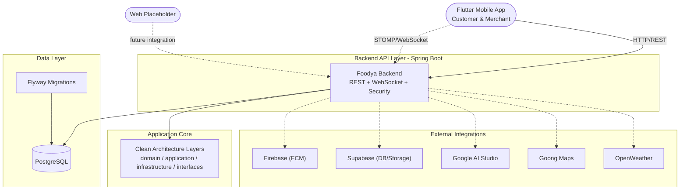

# Foodya

Foodya is a food delivery platform with a **Spring Boot backend** and a **Flutter mobile app** for Customer and Merchant roles, managed in a single repository.

## Core Features

- **Authentication & Session Management**: Register, login, refresh token, profile/password updates, and session invalidation.
- **Role-based Operations**: Dedicated APIs and workflows for Admin, Merchant, Customer, and Delivery.
- **Ordering Lifecycle**: Restaurant browsing, cart, checkout, order creation, tracking, and cancellation.
- **Engagement & Intelligence**: Reviews/replies, AI recommendation chat, notifications, and revenue/reporting flows.

## System Architecture Diagram



## Documentation

Project documentation is available in the `docs` and module-specific documentation:

- `docs/FOODYA_SRS.md` — software requirements specification and API baseline.
- `backend/README.md` — backend setup, migration, and verification commands.
- `mobile/README.md` — mobile setup and app structure.
- `backend/docs/SEED_ACCOUNTS.md` — seeded accounts for role-based API testing.

## Architecture Overview

- **Backend (`backend/`)**: Spring Boot 3.5, Java 21, Clean Architecture boundaries:
  - `domain`: entities and business rules
  - `application`: use cases, DTOs, and ports
  - `infrastructure`: adapters, persistence, and framework wiring
  - `interfaces/rest`: controllers and API DTOs
- **Mobile (`mobile/`)**: Flutter app using Material 3, `flutter_bloc`, and `go_router`.
- **Web (`web/`)**: reserved placeholder.

## Prerequisites

Before getting started, install:

- [Docker Desktop](https://www.docker.com/products/docker-desktop)
- [Java 21](https://adoptium.net/)
- [Maven 3.9+](https://maven.apache.org/)
- [Flutter SDK](https://docs.flutter.dev/get-started/install)
- [Git](https://git-scm.com/)

## Getting Started

### 1. Clone Repository

```bash
git clone https://github.com/dieuxuanhien/foodya.git
cd foodya
```

### 2. Backend Environment Variables

```bash
cp backend/.env.example backend/.env
```

Set required values in `backend/.env`, especially:

- `SPRING_DATASOURCE_URL`, `SPRING_DATASOURCE_USERNAME`, `SPRING_DATASOURCE_PASSWORD`
- `FOODYA_JWT_SECRET` (32+ chars)
- Integration keys you need for local testing

### 3. Run Backend + PostgreSQL with Docker Compose

```bash
cd backend
docker compose up -d --build
```

Check logs:

```bash
docker compose logs -f
```

### 4. Run Mobile App

```bash
cd mobile
flutter pub get
flutter run
```

If needed, override backend URL:

```bash
flutter run --dart-define=FOODYA_API_BASE_URL=http://<host>:8080
```

## Testing

Run backend tests:

```bash
cd backend
mvn test
```

Run mobile quality checks:

```bash
cd mobile
flutter analyze
flutter test
```

## Deployment & Access URLs

When running locally:

| Service | Access URL | Description |
| --- | --- | --- |
| **Backend API** | http://localhost:8080 | Main backend endpoint |
| **Swagger UI** | http://localhost:8080/swagger-ui.html | API documentation |
| **PostgreSQL** | localhost:5432 | Database port from Docker Compose |

For API authentication testing, use seeded accounts in `backend/docs/SEED_ACCOUNTS.md`.