# Foodya - Danh Sách Màn Hình Và Screen Flow

Tài liệu này tổng hợp các màn hình chính của Foodya theo router hiện tại của mobile app và admin web. Bảng chỉ liệt kê các màn hình có route riêng; các modal tạo/sửa/xác nhận được xem là thành phần phụ bên trong màn hình.

## 1. Bảng Danh Sách Màn Hình

| STT | Tên | Mô tả |
|---:|---|---|
| 1 | Mobile - Auth Loading (`/auth/loading`) | Màn hình khởi động phiên đăng nhập, kiểm tra token và điều hướng người dùng đến đúng vai trò. |
| 2 | Mobile - Login/Register (`/login`) | Màn hình đăng nhập, chuyển vai trò Customer/Merchant và đăng ký tài khoản mới. |
| 3 | Mobile - Forgot Password (`/forgot-password`) | Màn hình khôi phục mật khẩu cho người dùng. |
| 4 | Customer - Home (`/customer/home`) | Trang đầu tiên sau đăng nhập của khách hàng, hiển thị vị trí, hành động đặt món nhanh, nhà hàng gần đây và các lối tắt chính. |
| 5 | Customer - Browse Restaurants (`/customer/restaurants`) | Màn hình tìm kiếm, lọc và duyệt danh sách nhà hàng theo từ khóa, danh mục, sắp xếp hoặc vị trí gần đây. |
| 6 | Customer - Restaurant Detail (`/customer/restaurants/:id`) | Màn hình chi tiết nhà hàng, menu, món ăn, đánh giá và thao tác thêm món vào giỏ hàng. |
| 7 | Customer - Cart (`/customer/cart`) | Màn hình giỏ hàng, hiển thị các món đã chọn, số lượng, tạm tính và hành động tiếp tục thanh toán. |
| 8 | Customer - Checkout (`/customer/checkout`) | Màn hình xác nhận địa chỉ, vị trí giao hàng, phí giao, phương thức thanh toán và gửi đơn hàng. |
| 9 | Customer - Orders (`/customer/orders`) | Màn hình danh sách đơn hàng của khách hàng, hỗ trợ xem trạng thái và lịch sử đơn. |
| 10 | Customer - Order Detail (`/customer/orders/:id`) | Màn hình chi tiết đơn hàng, hiển thị thông tin đơn, trạng thái, hủy đơn khi được phép và bản đồ theo dõi khi đang giao. |
| 11 | Customer - Notifications (`/customer/notifications`) | Màn hình thông báo của khách hàng, hiển thị cập nhật đơn hàng và thông báo liên quan. |
| 12 | Customer - AI Chat (`/customer/ai`) | Màn hình chatbot/AI hỗ trợ gợi ý món ăn và tư vấn theo nhu cầu người dùng. |
| 13 | Customer - Profile (`/customer/profile`) | Màn hình tài khoản khách hàng, quản lý thông tin cá nhân, phiên đăng nhập và đăng xuất. |
| 14 | Merchant - Dashboard (`/merchant/home`) | Trang đầu tiên sau đăng nhập của nhà hàng, hiển thị tổng quan vận hành, trạng thái nhà hàng, đơn gần đây và chỉ số nhanh. |
| 15 | Merchant - Orders (`/merchant/orders`) | Màn hình quản lý đơn hàng của nhà hàng, xem chi tiết và cập nhật trạng thái xử lý đơn. |
| 16 | Merchant - Catalog (`/merchant/catalog`) | Màn hình quản lý danh mục menu và món ăn, tạo/sửa danh mục, tạo/sửa món và bật/tắt trạng thái món. |
| 17 | Merchant - Revenue/Insights (`/merchant/revenue`) | Màn hình báo cáo doanh thu, thống kê đơn hàng và tổng quan hiệu quả kinh doanh. |
| 18 | Merchant - Restaurant Setup (`/merchant/restaurant`) | Màn hình tạo/cập nhật thông tin nhà hàng, địa chỉ, mô tả, hình ảnh, giờ mở cửa và trạng thái hoạt động. |
| 19 | Merchant - Reviews (`/merchant/reviews`) | Màn hình xem đánh giá của khách hàng và phản hồi đánh giá. |
| 20 | Merchant - Notifications (`/merchant/notifications`) | Màn hình thông báo cho nhà hàng, gồm cập nhật đơn hàng và các sự kiện vận hành. |
| 21 | Merchant - Profile (`/merchant/profile`) | Màn hình tài khoản nhà hàng, quản lý thông tin người dùng, phiên đăng nhập và đăng xuất. |
| 22 | Admin Web - Login (`/login`) | Màn hình đăng nhập vào hệ thống quản trị web. |
| 23 | Admin Web - Dashboard (`/`) | Màn hình tổng quan hệ thống, hiển thị số liệu nhanh về nhà hàng, đơn hàng và doanh thu. |
| 24 | Admin Web - Users (`/users`) | Màn hình quản lý người dùng, xem danh sách, tạo/sửa, khóa/mở khóa, phê duyệt và đặt lại mật khẩu. |
| 25 | Admin Web - Restaurants (`/restaurants`) | Màn hình quản lý nhà hàng, tìm kiếm, tạo/sửa, phê duyệt, từ chối, xóa và đi đến quản lý menu. |
| 26 | Admin Web - Orders (`/orders`) | Màn hình giám sát đơn hàng, xem chi tiết, cập nhật trạng thái và xóa đơn khi cần quản trị. |
| 27 | Admin Web - Delivery Orders (`/delivery-orders`) | Màn hình quản lý đơn giao hàng, theo dõi phân công giao hàng và cập nhật trạng thái delivery. |
| 28 | Admin Web - Categories (`/categories`) | Màn hình quản lý taxonomy/danh mục món ăn dùng chung cho hệ thống. |
| 29 | Admin Web - Menu Items (`/menu-items`) | Màn hình quản lý món ăn trên hệ thống theo nhà hàng và danh mục. |
| 30 | Admin Web - Revenue Reports (`/reports`) | Màn hình báo cáo doanh thu, đơn hàng, lợi nhuận nền tảng và biểu đồ thống kê. |
| 31 | Admin Web - Notifications (`/notifications`) | Màn hình quản lý/giám sát thông báo trong hệ thống. |
| 32 | Admin Web - Audit Logs (`/audit-logs`) | Màn hình nhật ký kiểm toán, theo dõi các hành động quản trị và sự kiện bảo mật. |
| 33 | Admin Web - System Parameters (`/system-params`) | Màn hình cấu hình tham số hệ thống, gồm các giá trị có thể áp dụng khi vận hành. |

## 2. Sơ Đồ Luồng Màn Hình (Screen Flow Diagram)

```mermaid
flowchart TD
    Start([Mở ứng dụng / truy cập hệ thống])

    Start --> MobileAuthLoading[Mobile: Auth Loading]
    MobileAuthLoading -->|Chưa đăng nhập| MobileLogin[Mobile: Login/Register]
    MobileAuthLoading -->|Đã đăng nhập Customer| CustomerHome[Customer: Home]
    MobileAuthLoading -->|Đã đăng nhập Merchant| MerchantHome[Merchant: Dashboard]
    MobileLogin --> MobileForgot[Mobile: Forgot Password]
    MobileForgot --> MobileLogin
    MobileLogin -->|Đăng nhập Customer| CustomerHome
    MobileLogin -->|Đăng nhập Merchant| MerchantHome

    subgraph CustomerFlow[Mobile Customer Flow]
        CustomerHome --> CustomerBrowse[Browse Restaurants]
        CustomerHome --> CustomerCart[Cart]
        CustomerHome --> CustomerOrders[Orders]
        CustomerHome --> CustomerProfile[Profile]
        CustomerHome --> CustomerAI[AI Chat]
        CustomerHome --> CustomerNotifications[Notifications]

        CustomerBrowse --> CustomerRestaurantDetail[Restaurant Detail]
        CustomerRestaurantDetail --> CustomerCart
        CustomerCart --> CustomerCheckout[Checkout]
        CustomerCheckout -->|Đặt hàng thành công| CustomerOrderDetail[Order Detail]
        CustomerOrders --> CustomerOrderDetail
        CustomerOrderDetail -->|Theo dõi khi DELIVERING| CustomerOrderTracking[Tracking Map]
        CustomerOrderDetail --> CustomerOrders
        CustomerNotifications --> CustomerOrderDetail
        CustomerAI --> CustomerBrowse
        CustomerProfile -->|Đăng xuất| MobileLogin
    end

    subgraph MerchantFlow[Mobile Merchant Flow]
        MerchantHome --> MerchantOrders[Orders]
        MerchantHome --> MerchantCatalog[Catalog]
        MerchantHome --> MerchantRevenue[Revenue/Insights]
        MerchantHome --> MerchantProfile[Profile]
        MerchantHome --> MerchantRestaurant[Restaurant Setup]
        MerchantHome --> MerchantReviews[Reviews]
        MerchantHome --> MerchantNotifications[Notifications]

        MerchantOrders -->|Xem/cập nhật trạng thái đơn| MerchantOrders
        MerchantCatalog -->|Tạo/sửa danh mục và món| MerchantCatalog
        MerchantRestaurant -->|Cập nhật thông tin nhà hàng| MerchantHome
        MerchantReviews -->|Phản hồi đánh giá| MerchantReviews
        MerchantNotifications --> MerchantOrders
        MerchantProfile -->|Đăng xuất| MobileLogin
    end

    Start --> AdminLogin[Admin Web: Login]
    AdminLogin -->|Đăng nhập admin| AdminDashboard[Admin Web: Dashboard]

    subgraph AdminWebFlow[Admin Web Flow]
        AdminDashboard --> AdminUsers[Users]
        AdminDashboard --> AdminRestaurants[Restaurants]
        AdminDashboard --> AdminOrders[Orders]
        AdminDashboard --> AdminDeliveryOrders[Delivery Orders]
        AdminDashboard --> AdminCategories[Categories]
        AdminDashboard --> AdminMenuItems[Menu Items]
        AdminDashboard --> AdminReports[Revenue Reports]
        AdminDashboard --> AdminNotifications[Notifications]
        AdminDashboard --> AdminAuditLogs[Audit Logs]
        AdminDashboard --> AdminSystemParams[System Parameters]

        AdminRestaurants -->|Manage Menu| AdminMenuItems
        AdminOrders -->|Xem chi tiết/cập nhật trạng thái| AdminOrders
        AdminDeliveryOrders -->|Cập nhật delivery status| AdminDeliveryOrders
        AdminUsers -->|Khóa/mở khóa/phê duyệt| AdminUsers
        AdminCategories -->|Tạo/sửa/xóa taxonomy| AdminCategories
        AdminMenuItems -->|Tạo/sửa/xóa món| AdminMenuItems
        AdminReports --> AdminDashboard
        AdminNotifications --> AdminOrders
        AdminAuditLogs --> AdminDashboard
        AdminSystemParams --> AdminDashboard
    end
```

