Mr. Ngo - `<u>`<uit@gm.uit.edu.vn> `</u>`

Mr. Dinh - `<u>`<uit@gm.uit.edu.vn> `</u>`

_Prepared for_

Foodya Project

**Version 1.0**

**SOFTWARE REQUIREMENTS SPECIFICATION**

Foodya

**Revision and Sign Off Sheet**

**Change Record**

| Author                         | Version | Change reference                                       |    Date    |
| :----------------------------- | :-----: | :----------------------------------------------------- | :--------: |
| GitHub Copilot (GPT-5.3-Codex) |   0.1   | Initial implementable SRS draft from project brief     | 30/03/2026 |
| GitHub Copilot (GPT-5.3-Codex) |   1.0   | Final SRS with use cases, traceability, and DB diagram | 30/03/2026 |

**Reviewers**

| Name | Version | Position       | Date |
| :--- | :-----: | :------------- | :--: |
| TBD  |   1.0   | Supervisor     | TBD  |
| TBD  |   1.0   | Product Owner  | TBD  |
| TBD  |   1.0   | Technical Lead | TBD  |

**Pre-computation**

1. **Problem Understanding**Build a multi-role online food ordering platform with AI-assisted contextual recommendations, real-time order lifecycle updates, and role-specific operations for Customer, Merchant, Delivery (simulated), and Admin.
2. **Stakeholder Perspective**Customer needs fast discovery and reliable checkout. Merchant needs restaurant/menu/order operations and revenue visibility. Admin needs governance and platform control. Delivery role is simplified in `v1` via backend APIs only.
3. **System Boundary Definition (in-scope vs out-of-scope)**In-scope: auth, profile, restaurant/menu/order management, AI recommendation constrained to internal data, push notifications, delivery status simulation, reporting.Out-of-scope in `v1`: dedicated delivery app, autonomous dispatch optimization, marketplace multi-vendor economics, advanced loyalty/voucher engine.
4. **Constraints and Assumptions**External APIs are free-tier constrained. Backend is Linux + Docker friendly. AI outputs must be bounded by internal catalog. Weather and map integrations must use quota-aware caching. Timeline is academic-project scale.
5. **High-Level Architecture Direction**
   Start with modular monolith backend (Spring Boot) with clear bounded modules (`auth`, `catalog`, `orders`, `ai`, `notification`, `reporting`) and event-driven internal notifications. Use PostgreSQL as system of record, object storage for media, and FCM for push.

**Table of Contents**

[**1. Introduction**](#introduction)

> [1.1. Purpose](#purpose)
>
> [1.2. Scope](#scope)
>
> [1.3. Intended Audiences and Document Organization](#intended-audiences-and-document-organization)

[**2. Functional Requirements**](#functional-requirements)

[**2.1. Use Case Description**](#use-case-description)

> [UC1: Register account](#uc1-register-account)
>
> [UC2: Login and token refresh](#uc2-login-and-token-refresh)
>
> [UC3: Manage profile and password](#uc3-manage-profile-and-password)
>
> [UC4: Browse restaurants and menus](#uc4-browse-restaurants-and-menus)
>
> [UC5: Create order from cart](#uc5-create-order-from-cart)
>
> [UC6: Track and cancel order](#uc6-track-and-cancel-order)
>
> [UC7: Leave and respond to review](#uc7-leave-and-respond-to-review)
>
> [UC8: Merchant restaurant management](#uc8-merchant-restaurant-management)
>
> [UC9: Merchant menu and category management](#uc9-merchant-menu-and-category-management)
>
> [UC10: Merchant order processing](#uc10-merchant-order-processing)
>
> [UC11: Delivery simulation updates](#uc11-delivery-simulation-updates)
>
> [UC12: Admin user management](#uc12-admin-user-management)
>
> [UC13: Admin platform governance](#uc13-admin-platform-governance)
>
> [UC14: AI recommendation chat](#uc14-ai-recommendation-chat)
>
> [UC15: Push notifications](#uc15-push-notifications)
>
> [UC16: Analytics and revenue reports](#uc16-analytics-and-revenue-reports)
>
> [UC17: Logout and session invalidation](#uc17-logout-and-session-invalidation)
>
> [UC18: Cart management lifecycle](#uc18-cart-management-lifecycle)
>
> [UC19: Real-time delivery location tracking](#uc19-real-time-delivery-location-tracking)
>
> [UC20: Checkout payment and settlement](#uc20-checkout-payment-and-settlement)
>
> [UC21: Configure system parameters](#uc21-configure-system-parameters)

[**2.2. List Description**](#list-description)

[**2.3. View Description**](#view-description)

[**2.4. Requirements Traceability Matrix**](#requirements-traceability-matrix)

[**3. Non-functional Requirements**](#non-functional-requirements)

> [3.1. User Access and Security](#31-user-access-and-security)
>
> [3.2. Performance Requirements](#32-performance-requirements)
>
> [3.3. Implementation Requirements](#33-implementation-requirements)

[**4. Appendixes**](#appendixes)

> [Glossary](#glossary)
>
> [Messages](#messages)
>
> [Issues List](#issues-list)

# Introduction

## **Purpose**

This document specifies implementable software requirements for Foodya, an online food ordering system with contextual AI recommendation. It is the baseline for architecture, implementation, testing, and acceptance.

## **Scope**

The system includes:

- Multi-role authentication and authorization (`CUSTOMER`, `MERCHANT`, `DELIVERY`, `ADMIN`).
- Restaurant discovery, menu browsing, cart, ordering, and order lifecycle tracking.
- Merchant operations for restaurant, menu, order handling, and response to customer reviews.
- Admin operations for user, restaurant, menu hard-delete, and platform-wide order/report governance.
- AI recommendation chat constrained to internal catalog and contextual inputs.
- Push notifications for customer and merchant events.
- Simulated delivery API flow in backend (`v1`, no standalone delivery app).

Out of scope:

- Full delivery mobile app.
- Dynamic dispatch optimization algorithm.
- Loyalty points and campaign engine.
- Multi-tenant marketplace finance settlement.

## **Intended Audiences and Document Organization**

This SRS is intended for:

- Development Team: implement APIs, data model, jobs, and integrations.
- QA/UAT Team: derive test cases from FR/BR/NFR and acceptance criteria.
- Product and Supervisor: validate scope and expected behavior.
- Operations and Security: validate deployment and controls.

# Functional Requirements

## Requirement Baseline

### Functional Requirements

| FR ID | Name                            | Main actor(s)                | Description                                                                                                                                                                           |
| :---- | :------------------------------ | :--------------------------- | :------------------------------------------------------------------------------------------------------------------------------------------------------------------------------------ |
| FR01  | Account registration            | Customer, Merchant, Delivery | Register with username, email, password, full name, phone, role.                                                                                                                      |
| FR02  | Login                           | All roles                    | Login and get `accessToken` + `refreshToken`.                                                                                                                                         |
| FR03  | Refresh session                 | All roles                    | Renew access token from valid refresh token.                                                                                                                                          |
| FR04  | Password recovery and change    | All roles                    | Forgot-password via email OTP and authenticated password change.                                                                                                                      |
| FR05  | View profile                    | All roles                    | View own profile data.                                                                                                                                                                |
| FR06  | Update profile                  | All roles                    | Update full name, email, phone, avatar URL with uniqueness checks.                                                                                                                    |
| FR07  | List restaurants                | Customer                     | Keyword search must match restaurant name or menu item name, then return restaurant-grouped results with matched menu items under each restaurant. Supports filter, sort, pagination. |
| FR08  | Restaurant detail               | Customer                     | View restaurant profile, availability, rating, delivery constraints.                                                                                                                  |
| FR09  | Menu browse/search              | Customer                     | View/search menu by keyword, category, popularity.                                                                                                                                    |
| FR10  | Create order                    | Customer                     | Build order with items, address, note, and delivery fee calculated from Goong Maps route distance using platform-configured shipping parameters.                                      |
| FR11  | My orders management            | Customer                     | View active/history orders, cancel eligible orders.                                                                                                                                   |
| FR12  | Order review                    | Customer                     | Rate successful order with stars and comment.                                                                                                                                         |
| FR13  | Merchant restaurant management  | Merchant                     | Create/update own restaurant, open/close status.                                                                                                                                      |
| FR14  | Merchant category management    | Merchant                     | CRUD menu categories for owned restaurant.                                                                                                                                            |
| FR15  | Merchant menu item management   | Merchant                     | CRUD-soft-delete menu items and availability toggle.                                                                                                                                  |
| FR16  | Merchant order operations       | Merchant                     | View orders, update order status, reply to feedback.                                                                                                                                  |
| FR17  | Admin user management           | Admin                        | List, lock/unlock, delete users.                                                                                                                                                      |
| FR18  | Admin restaurant governance     | Admin                        | View all, approve/reject, delete restaurants.                                                                                                                                         |
| FR19  | Admin order governance          | Admin                        | Filter, inspect, update status, delete orders.                                                                                                                                        |
| FR20  | Hard delete menu item           | Admin                        | Permanently remove menu item from database.                                                                                                                                           |
| FR21  | Delivery simulation API         | Delivery                     | Accept and update delivery status on assigned order.                                                                                                                                  |
| FR22  | Contextual AI recommendation    | Customer                     | AI suggests internal-catalog items by user context.                                                                                                                                   |
| FR23  | Push notifications              | Customer, Merchant           | Real-time event notifications for orders.                                                                                                                                             |
| FR24  | Platform revenue reporting      | Admin                        | Revenue/profit dashboards over time.                                                                                                                                                  |
| FR25  | Merchant revenue reporting      | Merchant                     | Revenue by period and top-selling items.                                                                                                                                              |
| FR26  | Logout and session invalidation | All roles                    | Logout current/all sessions by revoking refresh tokens and session family.                                                                                                            |
| FR27  | Cart management                 | Customer                     | Add/update/remove items, clear cart, and enforce single-restaurant cart scope.                                                                                                        |
| FR28  | Real-time delivery tracking     | Delivery, Customer           | Delivery app/API posts location points; customer views live route updates.                                                                                                            |
| FR29  | Payment and settlement baseline | Customer, Admin, Merchant    | MVP payment method handling (`COD`) with deterministic payment state and platform profit fields.                                                                                      |
| FR30  | Nearby restaurant discovery     | Customer                     | Find nearby restaurants using Uber H3 indexing for fast geospatial candidate lookup and straight-line distance sorting.                                                               |
| FR31  | System parameter management     | Admin                        | Configure runtime parameters (shipping fees, max distance, H3/search settings, cache TTL, and safety limits) without code deploy.                                                     |

### Business Rules

| BR ID | Rule                                                                                                                                                                                                                                                                                                                                                |
| :---- | :-------------------------------------------------------------------------------------------------------------------------------------------------------------------------------------------------------------------------------------------------------------------------------------------------------------------------------------------------- |
| BR01  | `username` is globally unique.                                                                                                                                                                                                                                                                                                                      |
| BR02  | `email` is globally unique and valid format.                                                                                                                                                                                                                                                                                                        |
| BR03  | `phoneNumber` is globally unique and normalized format.                                                                                                                                                                                                                                                                                             |
| BR04  | Password >= 8 chars and must contain uppercase, lowercase, number, special char.                                                                                                                                                                                                                                                                    |
| BR05  | Password change requires valid `currentPassword`.                                                                                                                                                                                                                                                                                                   |
| BR06  | `newPassword` equals `confirmPassword`.                                                                                                                                                                                                                                                                                                             |
| BR07  | New password must differ from old password.                                                                                                                                                                                                                                                                                                         |
| BR08  | Profile read/update only for owner account (except admin actions).                                                                                                                                                                                                                                                                                  |
| BR09  | Changing email/phone must pass uniqueness validation before commit.                                                                                                                                                                                                                                                                                 |
| BR10  | Order creation requires `restaurantId`, non-empty `items`, valid `deliveryAddress`.                                                                                                                                                                                                                                                                 |
| BR11  | Each order item requires valid `menuItemId` and `quantity > 0`.                                                                                                                                                                                                                                                                                     |
| BR12  | All order items belong to a single restaurant.                                                                                                                                                                                                                                                                                                      |
| BR13  | Only active and available menu items are orderable.                                                                                                                                                                                                                                                                                                 |
| BR14  | `totalAmount = itemsSubtotal + deliveryFee`.                                                                                                                                                                                                                                                                                                        |
| BR15  | Customer may cancel only own order.                                                                                                                                                                                                                                                                                                                 |
| BR16  | Cancellation allowed only in `PENDING`, `ACCEPTED`, `ASSIGNED`.                                                                                                                                                                                                                                                                                     |
| BR17  | Review allowed only for `SUCCESS` orders.                                                                                                                                                                                                                                                                                                           |
| BR18  | Order status flow:`PENDING -> ACCEPTED -> ASSIGNED -> PREPARING -> DELIVERING -> SUCCESS` or terminal `CANCELLED`/`FAILED`.                                                                                                                                                                                                                         |
| BR19  | Merchant can manage only owned restaurants and related catalog/orders.                                                                                                                                                                                                                                                                              |
| BR20  | `/api/v1/admin/**` endpoints require `ADMIN`; `/api/v1/merchant/**` require `MERCHANT` or `ADMIN`.                                                                                                                                                                                                                                                  |
| BR21  | Menu item price must be `> 0` and within configured numeric bounds.                                                                                                                                                                                                                                                                                 |
| BR22  | Restaurant data must satisfy name/address/cuisine/open-close format constraints.                                                                                                                                                                                                                                                                    |
| BR23  | Max delivery distance must be non-negative and <= platform parameter `shipping.max_delivery_km`.                                                                                                                                                                                                                                                    |
| BR24  | Hard-delete policy is deterministic: menu items can be hard-deleted anytime; users/restaurants can be hard-deleted only when they have no linked orders in `PENDING                                                                                                                                                                                 |
| BR25  | Delivery flow in `v1` is backend status simulation.                                                                                                                                                                                                                                                                                                 |
| BR26  | AI suggestions must be strictly from internal valid menu/restaurant data.                                                                                                                                                                                                                                                                           |
| BR27  | Logout revokes refresh token jti; revoked token reuse must be rejected.                                                                                                                                                                                                                                                                             |
| BR28  | One customer can have only one `ACTIVE` cart at a time.                                                                                                                                                                                                                                                                                             |
| BR29  | Active cart must contain items from one restaurant only.                                                                                                                                                                                                                                                                                            |
| BR30  | Delivery location update must include `lat`, `lng`, and `recordedAt`.                                                                                                                                                                                                                                                                               |
| BR31  | Location updates accepted only when order status is `ASSIGNED` or `DELIVERING`.                                                                                                                                                                                                                                                                     |
| BR32  | MVP payment method is `COD`; payment status changes only via allowed transitions.                                                                                                                                                                                                                                                                   |
| BR33  | Platform profit is computed as `platform_profit_amount = commission_amount + shipping_fee_margin_amount`, where `commission_amount = round(subtotal_amount * finance.commission_rate_percent / 100, currency.minor_unit)` and `shipping_fee_margin_amount = round(delivery_fee * finance.shipping_margin_rate_percent / 100, currency.minor_unit)`. |
| BR34  | `POST /api/v1/customer/orders` must support idempotency using `Idempotency-Key`.                                                                                                                                                                                                                                                                    |
| BR35  | Search response is grouped by restaurant. If keyword matches menu items, return parent restaurant and only matched menu items in `matchedItems`.                                                                                                                                                                                                    |
| BR36  | Weather cache key must be computed from Uber H3 index (`h3_index_res8`) derived from latitude/longitude.                                                                                                                                                                                                                                            |
| BR37  | Nearby restaurant search must prefilter by Uber H3 k-ring from user location, then use straight-line distance for filtering/sorting.                                                                                                                                                                                                                |
| BR38  | Each restaurant must persist canonical Uber H3 index (`h3_index_res9`) for nearby search optimization.                                                                                                                                                                                                                                              |
| BR39  | Delivery distance for fee calculation must be fetched from Goong Maps route API (not straight-line distance).                                                                                                                                                                                                                                       |
| BR40  | Delivery fee formula uses platform parameters: if `distanceKm <= shipping.base_distance_km` then `deliveryFee = shipping.base_delivery_fee`; else `deliveryFee = shipping.base_delivery_fee + (distanceKm - shipping.base_distance_km) * shipping.fee_per_km`.                                                                                      |
| BR41  | Global system parameters are stored as typed key-value records (`NUMBER`, `BOOLEAN`, `STRING`, `JSON`) with validation constraints.                                                                                                                                                                                                                 |
| BR42  | Only `ADMIN` can update system parameters, and every change must be written to audit logs with previous and new values.                                                                                                                                                                                                                             |
| BR43  | Parameters marked as runtime-applicable are effective without redeploy; non-runtime parameters require controlled restart/redeploy.                                                                                                                                                                                                                 |
| BR44  | Shipping policy is platform-owned: delivery fee and max distance are sourced from global `system_parameters` only (no restaurant-level override).                                                                                                                                                                                                   |
| BR45  | Straight-line distance for nearby search must use Haversine formula on WGS84 coordinates and be returned as kilometers rounded to 3 decimal places.                                                                                                                                                                                                 |
| BR46  | Pagination defaults are `page=0`, `size=search.default_page_size`; max `size` is `search.max_page_size`; invalid pagination values return `422`.                                                                                                                                                                                                    |
| BR47  | Monetary fields are computed and persisted using configured currency policy keys (`currency.code`, `currency.minor_unit`, `currency.rounding_mode`).                                                                                                                                                                                                |
| BR48  | Data retention and DR targets are mandatory system parameters and must be enforced by scheduled jobs (`retention.*`, `ops.backup.rpo_minutes`, `ops.backup.rto_minutes`).                                                                                                                                                                           |
| BR49  | `orders.payment_status` is the canonical payment state; `order_payments.payment_status` is an event/audit mirror and must match the canonical value at commit.                                                                                                                                                                                      |
| BR50  | All foreign keys must declare explicit `ON DELETE`/`ON UPDATE` actions as defined in the Physical DDL Contract section; implicit DB defaults are not allowed.                                                                                                                                                                                       |

## Use Case Description

### UC1: Register account

|                    |                                                                           |
| :----------------- | :------------------------------------------------------------------------ |
| **Name**           | Register account                                                          |
| **Description**    | New user creates account by role type.                                    |
| **Actor**          | Customer, Merchant, Delivery                                              |
| **Trigger**        | User submits registration form.                                           |
| **Pre-condition**  | User is unauthenticated.                                                  |
| **Post-condition** | Account created with `ACTIVE` or `PENDING_APPROVAL` state by role policy. |

#### Activities Flow

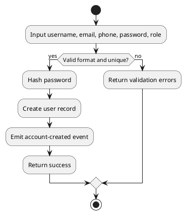

#### Business Rules

| Activity                 | BR Code          | Description                                    |
| :----------------------- | :--------------- | :--------------------------------------------- |
| Validate identity fields | BR01, BR02, BR03 | Username/email/phone must be unique and valid. |
| Password policy          | BR04             | Password complexity enforced server-side.      |

### UC2: Login and token refresh

|                    |                                                       |
| :----------------- | :---------------------------------------------------- |
| **Name**           | Login and token refresh                               |
| **Description**    | User authenticates and refreshes session securely.    |
| **Actor**          | All roles                                             |
| **Trigger**        | User submits login or refresh token.                  |
| **Pre-condition**  | Active account exists.                                |
| **Post-condition** | Valid token pair issued and session metadata updated. |

#### Activities Flow

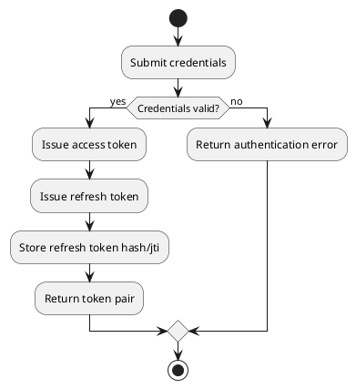

#### Business Rules

| Activity               | BR Code | Description                          |
| :--------------------- | :------ | :----------------------------------- |
| Endpoint authorization | BR20    | Role checks enforced at route level. |

### UC3: Manage profile and password

|                    |                                                    |
| :----------------- | :------------------------------------------------- |
| **Name**           | Manage profile and password                        |
| **Description**    | User views/edits own profile and changes password. |
| **Actor**          | All roles                                          |
| **Trigger**        | User opens profile settings.                       |
| **Pre-condition**  | User authenticated.                                |
| **Post-condition** | Profile/password updated with audit trail.         |

#### Activities Flow

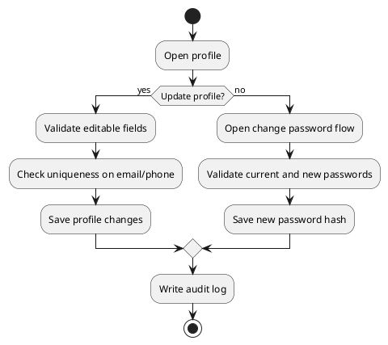

#### Business Rules

| Activity         | BR Code          | Description                                          |
| :--------------- | :--------------- | :--------------------------------------------------- |
| Self ownership   | BR08             | User can only edit own profile.                      |
| Identity updates | BR09             | Email/phone uniqueness validation required.          |
| Password update  | BR05, BR06, BR07 | Current password check and new password constraints. |

### UC4: Browse restaurants and menus

|                    |                                                     |
| :----------------- | :-------------------------------------------------- |
| **Name**           | Browse restaurants and menus                        |
| **Description**    | Customer searches restaurants and menu items.       |
| **Actor**          | Customer                                            |
| **Trigger**        | Customer enters search/filter conditions.           |
| **Pre-condition**  | Public or authenticated browsing policy enabled.    |
| **Post-condition** | Paginated results returned with consistent filters. |

#### Activities Flow

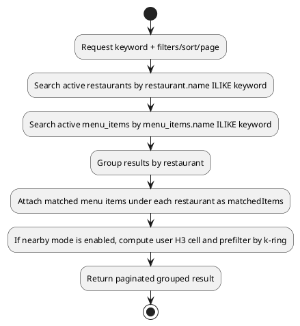

#### Business Rules

| Activity                 | BR Code    | Description                                                                           |
| :----------------------- | :--------- | :------------------------------------------------------------------------------------ |
| Data validity            | BR22, BR23 | Restaurant metadata and delivery bounds enforced.                                     |
| Grouped search behavior  | BR35       | Keyword matches restaurant or menu item names and returns grouped restaurant results. |
| Nearby geospatial filter | BR37, BR38 | Nearby mode uses H3 prefilter and straight-line distance sort.                        |

### UC5: Create order from cart

|                    |                                                                |
| :----------------- | :------------------------------------------------------------- |
| **Name**           | Create order from cart                                         |
| **Description**    | Customer submits cart and creates a payable order.             |
| **Actor**          | Customer                                                       |
| **Trigger**        | Customer confirms checkout.                                    |
| **Pre-condition**  | Cart contains valid items from one restaurant.                 |
| **Post-condition** | Order is created in `PENDING` and notifications are triggered. |

#### Activities Flow

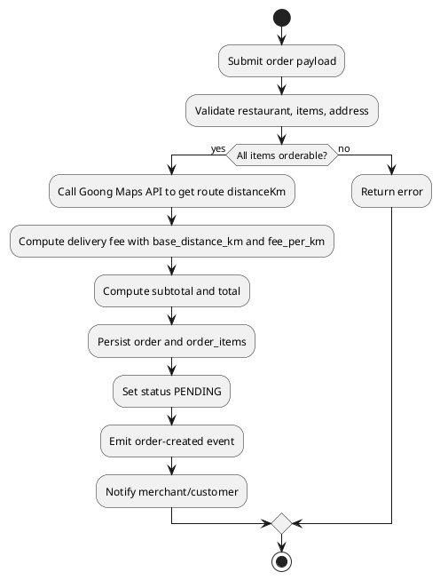

#### Business Rules

| Activity                     | BR Code          | Description                                          |
| :--------------------------- | :--------------- | :--------------------------------------------------- |
| Order payload                | BR10, BR11, BR12 | Required structure and single-restaurant constraint. |
| Orderability and totals      | BR13, BR14, BR21 | Item availability and pricing formula enforced.      |
| Delivery fee distance source | BR39             | Delivery distance comes from Goong route API.        |
| Delivery fee formula         | BR40             | Delivery fee uses base fee plus extra km pricing.    |

### UC6: Track and cancel order

|                    |                                                      |
| :----------------- | :--------------------------------------------------- |
| **Name**           | Track and cancel order                               |
| **Description**    | Customer monitors status and cancels if eligible.    |
| **Actor**          | Customer                                             |
| **Trigger**        | Customer opens order detail or taps cancel.          |
| **Pre-condition**  | Order exists and belongs to customer.                |
| **Post-condition** | Timeline displayed; optional cancellation processed. |

#### Activities Flow

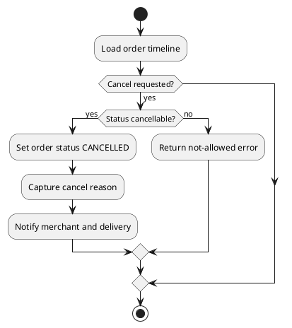

#### Business Rules

| Activity    | BR Code    | Description                                              |
| :---------- | :--------- | :------------------------------------------------------- |
| Ownership   | BR15       | Cancel allowed only for order owner.                     |
| Status gate | BR16, BR18 | Cancel only in permitted states and follow status model. |

### UC7: Leave and respond to review

|                    |                                                        |
| :----------------- | :----------------------------------------------------- |
| **Name**           | Leave and respond to review                            |
| **Description**    | Customer rates completed orders; merchant replies.     |
| **Actor**          | Customer, Merchant                                     |
| **Trigger**        | Customer submits review; merchant opens review center. |
| **Pre-condition**  | Order status is `SUCCESS`.                             |
| **Post-condition** | Review and optional merchant response are persisted.   |

#### Activities Flow

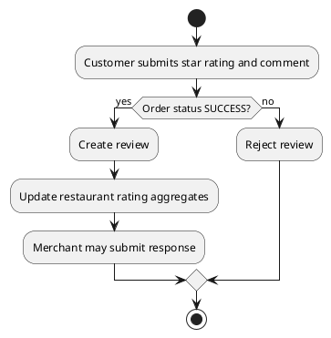

#### Business Rules

| Activity    | BR Code | Description                             |
| :---------- | :------ | :-------------------------------------- |
| Eligibility | BR17    | Only successful orders can be reviewed. |

### UC8: Merchant restaurant management

|                    |                                                         |
| :----------------- | :------------------------------------------------------ |
| **Name**           | Merchant restaurant management                          |
| **Description**    | Merchant creates and updates owned restaurant profiles. |
| **Actor**          | Merchant                                                |
| **Trigger**        | Merchant uses restaurant management screen.             |
| **Pre-condition**  | Merchant authenticated and authorized.                  |
| **Post-condition** | Restaurant profile updated with ownership validation.   |

#### Activities Flow

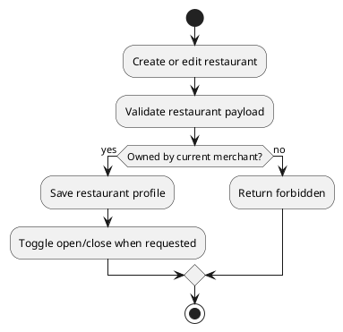

#### Business Rules

| Activity            | BR Code    | Description                                              |
| :------------------ | :--------- | :------------------------------------------------------- |
| Ownership and scope | BR19       | Merchant constrained to owned resources.                 |
| Data format         | BR22, BR23 | Restaurant fields and delivery distance limits enforced. |

### UC9: Merchant menu and category management

|                    |                                                                  |
| :----------------- | :--------------------------------------------------------------- |
| **Name**           | Merchant menu and category management                            |
| **Description**    | Merchant manages categories and menu items per restaurant.       |
| **Actor**          | Merchant                                                         |
| **Trigger**        | Merchant opens menu management page.                             |
| **Pre-condition**  | Merchant owns target restaurant.                                 |
| **Post-condition** | Category/item changes stored and visible to customers by status. |

#### Activities Flow

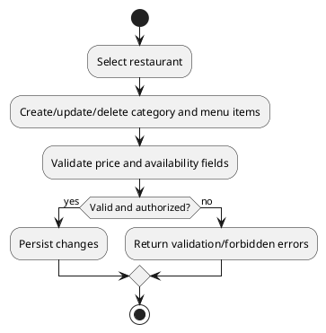

#### Business Rules

| Activity            | BR Code | Description                                      |
| :------------------ | :------ | :----------------------------------------------- |
| Ownership           | BR19    | Merchant can edit only owned restaurant catalog. |
| Pricing constraints | BR21    | Price must be > 0 and in configured bounds.      |

### UC10: Merchant order processing

|                    |                                                            |
| :----------------- | :--------------------------------------------------------- |
| **Name**           | Merchant order processing                                  |
| **Description**    | Merchant accepts/prepares orders and responds to feedback. |
| **Actor**          | Merchant                                                   |
| **Trigger**        | Merchant opens incoming orders list.                       |
| **Pre-condition**  | Order belongs to merchant restaurant.                      |
| **Post-condition** | Order state moved forward in valid transition path.        |

#### Activities Flow

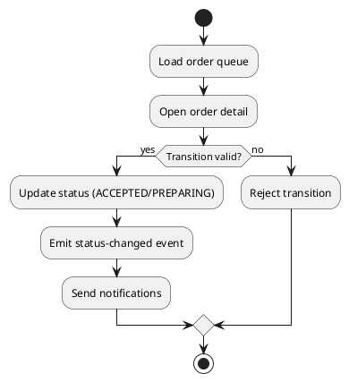

#### Business Rules

| Activity        | BR Code    | Description                                  |
| :-------------- | :--------- | :------------------------------------------- |
| Status workflow | BR18       | Only valid state transitions are accepted.   |
| Access scope    | BR19, BR20 | Merchant role and ownership checks required. |

### UC11: Delivery simulation updates

|                    |                                                               |
| :----------------- | :------------------------------------------------------------ |
| **Name**           | Delivery simulation updates                                   |
| **Description**    | Delivery actor accepts assignment and updates delivery state. |
| **Actor**          | Delivery                                                      |
| **Trigger**        | Delivery calls assignment/status API.                         |
| **Pre-condition**  | Order is in assignable status.                                |
| **Post-condition** | Order progresses through delivery simulation states.          |

#### Activities Flow

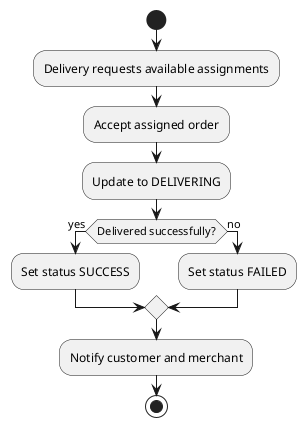

#### Business Rules

| Activity       | BR Code | Description                                       |
| :------------- | :------ | :------------------------------------------------ |
| Delivery scope | BR25    | Delivery flow is API-level simulation in v1.      |
| Status model   | BR18    | Status changes must follow defined state machine. |

### UC12: Admin user management

|                    |                                                  |
| :----------------- | :----------------------------------------------- |
| **Name**           | Admin user management                            |
| **Description**    | Admin governs user lifecycle and account status. |
| **Actor**          | Admin                                            |
| **Trigger**        | Admin opens user management view.                |
| **Pre-condition**  | Admin authenticated.                             |
| **Post-condition** | User account status updated with audit record.   |

#### Activities Flow

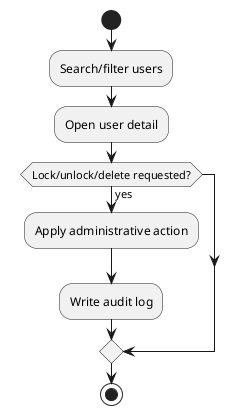

#### Business Rules

| Activity                  | BR Code | Description                            |
| :------------------------ | :------ | :------------------------------------- |
| Admin endpoint protection | BR20    | `/admin/**` protected by ADMIN role.   |
| Deletion policy           | BR24    | Hard-delete follows governance policy. |

### UC13: Admin platform governance

|                    |                                                                |
| :----------------- | :------------------------------------------------------------- |
| **Name**           | Admin platform governance                                      |
| **Description**    | Admin governs restaurants, orders, and hard-delete operations. |
| **Actor**          | Admin                                                          |
| **Trigger**        | Admin uses governance dashboards.                              |
| **Pre-condition**  | Admin authenticated.                                           |
| **Post-condition** | Governance changes persisted and auditable.                    |

#### Activities Flow

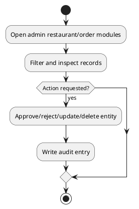

#### Business Rules

| Activity         | BR Code    | Description                                   |
| :--------------- | :--------- | :-------------------------------------------- |
| Governance scope | BR20, BR24 | Admin-only operations and hard-delete policy. |

### UC14: AI recommendation chat

|                    |                                                                  |
| :----------------- | :--------------------------------------------------------------- |
| **Name**           | AI recommendation chat                                           |
| **Description**    | Customer asks AI for context-aware recommendations.              |
| **Actor**          | Customer                                                         |
| **Trigger**        | Customer submits natural-language prompt.                        |
| **Pre-condition**  | AI module and required integrations are available.               |
| **Post-condition** | Recommended items returned and linked to valid catalog entities. |

#### Activities Flow

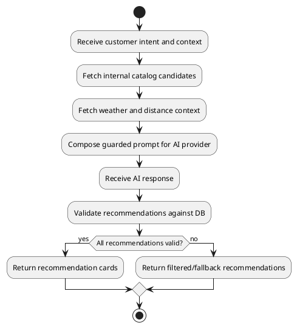

#### Business Rules

| Activity      | BR Code | Description                                         |
| :------------ | :------ | :-------------------------------------------------- |
| Domain safety | BR26    | AI output must map to internal valid entities only. |
| Orderability  | BR13    | Recommended menu item must be active/available.     |

### UC15: Push notifications

|                    |                                                              |
| :----------------- | :----------------------------------------------------------- |
| **Name**           | Push notifications                                           |
| **Description**    | System pushes order-related events to customer and merchant. |
| **Actor**          | Customer, Merchant                                           |
| **Trigger**        | Order lifecycle event emitted.                               |
| **Pre-condition**  | Device token registered and active.                          |
| **Post-condition** | Notification delivered or retried/logged on failure.         |

#### Activities Flow

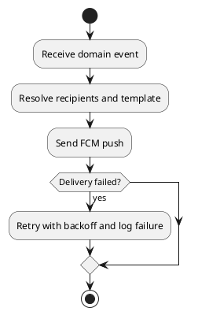

#### Business Rules

| Activity        | BR Code | Description                                         |
| :-------------- | :------ | :-------------------------------------------------- |
| Event semantics | BR18    | Notification types aligned with status transitions. |

### UC16: Analytics and revenue reports

|                    |                                                                 |
| :----------------- | :-------------------------------------------------------------- |
| **Name**           | Analytics and revenue reports                                   |
| **Description**    | Admin and merchant view revenue metrics by time and dimensions. |
| **Actor**          | Admin, Merchant                                                 |
| **Trigger**        | User requests report filters/date range.                        |
| **Pre-condition**  | Reporting tables and role access available.                     |
| **Post-condition** | Aggregated metrics returned with filter metadata.               |

#### Activities Flow

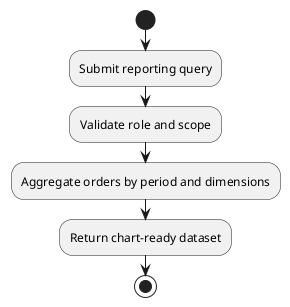

#### Business Rules

| Activity         | BR Code    | Description                                              |
| :--------------- | :--------- | :------------------------------------------------------- |
| Scope separation | BR19, BR20 | Merchant sees own restaurants; admin sees platform-wide. |

### UC17: Logout and session invalidation

|                    |                                                                              |
| :----------------- | :--------------------------------------------------------------------------- |
| **Name**           | Logout and session invalidation                                              |
| **Description**    | User logs out from current device or all devices by revoking refresh tokens. |
| **Actor**          | All roles                                                                    |
| **Trigger**        | User clicks logout or logout-all.                                            |
| **Pre-condition**  | User authenticated.                                                          |
| **Post-condition** | Session token(s) invalidated and cannot be reused.                           |

#### Activities Flow

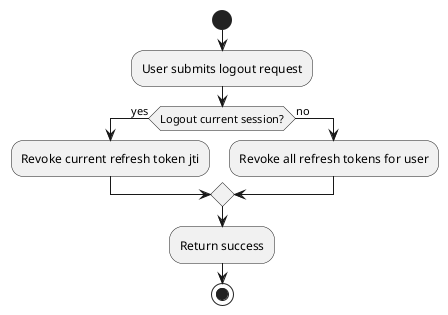

#### Business Rules

| Activity         | BR Code | Description                             |
| :--------------- | :------ | :-------------------------------------- |
| Token revocation | BR27    | Revoked refresh token cannot be reused. |

### UC18: Cart management lifecycle

|                    |                                                         |
| :----------------- | :------------------------------------------------------ |
| **Name**           | Cart management lifecycle                               |
| **Description**    | Customer maintains active cart before checkout.         |
| **Actor**          | Customer                                                |
| **Trigger**        | Customer adds/updates/removes items in cart.            |
| **Pre-condition**  | Customer authenticated; menu item active and available. |
| **Post-condition** | Cart state persisted and totals recalculated.           |

#### Activities Flow

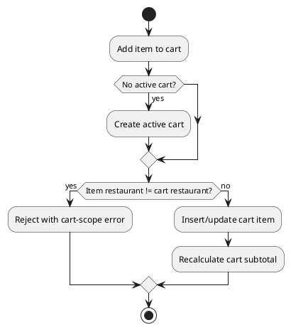

#### Business Rules

| Activity           | BR Code | Description                                          |
| :----------------- | :------ | :--------------------------------------------------- |
| Active cart policy | BR28    | One active cart per customer.                        |
| Restaurant scope   | BR29    | Active cart contains items from one restaurant only. |

### UC19: Real-time delivery location tracking

|                    |                                                                           |
| :----------------- | :------------------------------------------------------------------------ |
| **Name**           | Real-time delivery location tracking                                      |
| **Description**    | Delivery actor publishes live coordinates; customer tracks route updates. |
| **Actor**          | Delivery, Customer                                                        |
| **Trigger**        | Delivery app/API posts periodic location points.                          |
| **Pre-condition**  | Order assigned to delivery actor and in transit state.                    |
| **Post-condition** | Location points stored and latest route visible to customer.              |

#### Activities Flow

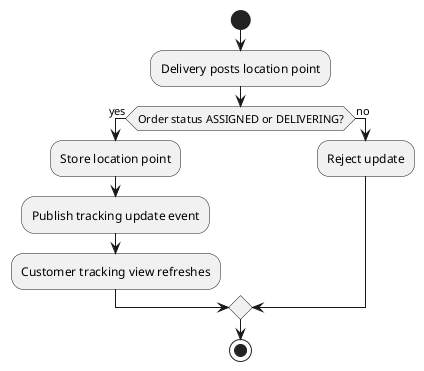

#### Business Rules

| Activity       | BR Code | Description                                           |
| :------------- | :------ | :---------------------------------------------------- |
| Payload schema | BR30    | Location update requires lat/lng/timestamp.           |
| State gate     | BR31    | Location accepted only in assigned/delivering states. |

### UC20: Checkout payment and settlement

|                    |                                                                                |
| :----------------- | :----------------------------------------------------------------------------- |
| **Name**           | Checkout payment and settlement                                                |
| **Description**    | Customer places order with MVP payment policy and settlement fields persisted. |
| **Actor**          | Customer, Admin, Merchant                                                      |
| **Trigger**        | Customer confirms checkout.                                                    |
| **Pre-condition**  | Active cart and valid delivery address exist.                                  |
| **Post-condition** | Order payment state and platform profit fields are stored deterministically.   |

#### Activities Flow

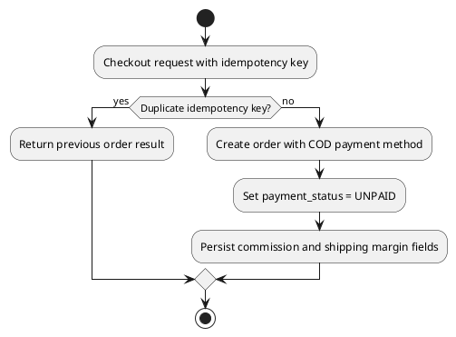

#### Business Rules

| Activity            | BR Code | Description                                                  |
| :------------------ | :------ | :----------------------------------------------------------- |
| MVP payment policy  | BR32    | Payment method is COD for MVP baseline.                      |
| Profit model        | BR33    | Platform profit formula stored consistently.                 |
| Idempotent checkout | BR34    | Duplicate checkout request must not create duplicate orders. |

### UC21: Configure system parameters

|                    |                                                                                                        |
| :----------------- | :----------------------------------------------------------------------------------------------------- |
| **Name**           | Configure system parameters                                                                            |
| **Description**    | Admin configures global runtime/system parameters used by shipping, search, AI, and platform behavior. |
| **Actor**          | Admin                                                                                                  |
| **Trigger**        | Admin updates values in system parameter console.                                                      |
| **Pre-condition**  | Admin authenticated with configuration permission.                                                     |
| **Post-condition** | Parameter values are validated, versioned, persisted, and applied according to runtime policy.         |

#### Activities Flow

```plantuml
@startuml
start
:Open system parameter console;
:Choose parameter key and input new value;
:Validate by type/range schema;
if (Valid?) then (yes)
  :Persist new value and increment version;
  :Write audit log with old/new value;
  if (runtime-applicable?) then (yes)
    :Apply immediately;
  else (no)
    :Mark pending restart/redeploy;
  endif
  :Return success;
else (no)
  :Return validation error;
endif
stop
@enduml
```

#### Business Rules

| Activity                | BR Code | Description                                                                    |
| :---------------------- | :------ | :----------------------------------------------------------------------------- |
| Parameter schema        | BR41    | Parameter key/value must satisfy typed schema and constraints.                 |
| Authorization and audit | BR42    | Only admin updates, with full audit history.                                   |
| Runtime application     | BR43    | Runtime parameters apply immediately, others staged for restart.               |
| Shipping ownership      | BR44    | Shipping policy is platform-level and read only from global system parameters. |

# List Description

| List ID | List Name                | Purpose                       | Key columns                                                               | API endpoint                                                                 |
| :------ | :----------------------- | :---------------------------- | :------------------------------------------------------------------------ | :--------------------------------------------------------------------------- |
| L01     | User List                | Admin user governance         | id, username, email, role, status, createdAt                              | `GET /api/v1/admin/users`                                                    |
| L02     | Restaurant Search Result | Discovery and management      | restaurantId, restaurantName, cuisine, rating, openStatus, matchedItems[] | `GET /api/v1/restaurants?q=` / `GET /api/v1/admin/restaurants`               |
| L03     | Menu Item List           | Menu browsing and maintenance | id, name, category, price, isAvailable                                    | `GET /api/v1/restaurants/{id}/menu-items`                                    |
| L04     | Order List (Customer)    | Customer order tracking       | id, code, status, totalAmount, createdAt                                  | `GET /api/v1/customer/orders`                                                |
| L05     | Order List (Merchant)    | Merchant order operations     | id, customer, status, totalAmount, createdAt                              | `GET /api/v1/merchant/restaurants/{id}/orders`                               |
| L06     | Platform Order List      | Admin order governance        | id, customer, merchant, status, totalAmount                               | `GET /api/v1/admin/orders`                                                   |
| L07     | Review List              | Customer feedback center      | id, orderCode, stars, comment, response                                   | `GET /api/v1/restaurants/{id}/reviews`                                       |
| L08     | Notification Log         | Delivery observability        | id, receiverType, title, status, sentAt                                   | `GET /api/v1/admin/notifications`                                            |
| L09     | AI Chat History          | AI interaction review         | id, userId, prompt, responseSummary, createdAt                            | `GET /api/v1/customer/ai/chats`                                              |
| L10     | Revenue Summary          | Dashboard aggregation         | period, revenue, orderCount, avgOrderValue                                | `GET /api/v1/admin/reports/revenue` / `GET /api/v1/merchant/reports/revenue` |
| L11     | Active Cart              | Customer checkout preparation | cartId, restaurantId, subtotal, itemCount                                 | `GET /api/v1/customer/carts/active`                                          |
| L12     | Delivery Tracking Points | Real-time route updates       | orderId, lat, lng, recordedAt                                             | `GET /api/v1/customer/orders/{id}/tracking`                                  |
| L13     | Nearby Restaurant List   | Proximity discovery           | restaurantId, restaurantName, h3Index, distanceKm, openStatus             | `GET /api/v1/restaurants/nearby`                                             |
| L14     | System Parameters        | Runtime configuration         | key, valueType, value, runtime, version, updatedAt                        | `GET /api/v1/admin/system-parameters`                                        |

# View Description

| View ID | View Name                                 | Actor              | Main components                                                          | Key actions                                                           |
| :------ | :---------------------------------------- | :----------------- | :----------------------------------------------------------------------- | :-------------------------------------------------------------------- |
| V01     | Register/Login View                       | All roles          | Auth forms, validation, role selector                                    | Register, login, forgot password                                      |
| V02     | Profile View                              | All roles          | Profile card, edit form, security section                                | Update profile, change password                                       |
| V03     | Restaurant Discovery View                 | Customer           | Search bar, filters, restaurant cards, grouped matched items, pagination | Search by keyword on restaurant or menu item, sort/filter/open detail |
| V04     | Restaurant Detail View                    | Customer           | Restaurant info, menu sections, ratings                                  | Add to cart, open AI suggestions                                      |
| V05     | Cart and Checkout View                    | Customer           | Cart lines, address form, fee summary                                    | Place order                                                           |
| V06     | Order Tracking View                       | Customer           | Timeline, status chip, cancel action                                     | Track, cancel, review                                                 |
| V07     | Merchant Restaurant Console               | Merchant           | Restaurant profile editor, open/close toggle                             | Create/update restaurant                                              |
| V08     | Merchant Menu Console                     | Merchant           | Category manager, item manager, availability                             | CRUD category/item                                                    |
| V09     | Merchant Order Console                    | Merchant           | Order queue, detail drawer, status actions                               | Accept/prepare/respond review                                         |
| V10     | Delivery Task View (API simulation panel) | Delivery           | Assignment list, status updater                                          | Accept, set delivering, complete/fail                                 |
| V11     | Admin User Console                        | Admin              | User table, filters, account status controls                             | Lock/unlock/delete user                                               |
| V12     | Admin Governance Console                  | Admin              | Restaurant/order modules, action logs                                    | Approve/delete/update                                                 |
| V13     | AI Chat View                              | Customer           | Conversation panel, recommendation cards                                 | Ask AI, add recommended item                                          |
| V14     | Notifications Center                      | Customer, Merchant | Notification list, unread badge                                          | Read, mark as read                                                    |
| V15     | Reporting Dashboard                       | Admin, Merchant    | Time filters, charts, KPI cards                                          | Query/export metrics                                                  |
| V16     | Cart Management View                      | Customer           | Cart lines, quantity controls, clear cart                                | Add/update/remove/clear cart                                          |
| V17     | Delivery Tracking Map View                | Customer           | Map canvas, latest driver marker, timeline                               | View live location and ETA                                            |
| V18     | System Parameters Console                 | Admin              | Parameter list, type-aware editor, change log                            | Update defaults and runtime configuration                             |

# Requirements Traceability Matrix

| Story ID | Story Summary                  | UC ID | FR ID(s)         | BR ID(s)                           | NFR ID(s)    |
| :------- | :----------------------------- | :---- | :--------------- | :--------------------------------- | :----------- |
| US-01    | Register new account           | UC1   | FR01             | BR01, BR02, BR03, BR04             | NFR01        |
| US-02    | Login and refresh session      | UC2   | FR02, FR03       | BR20                               | NFR01, NFR02 |
| US-03    | Manage profile/password        | UC3   | FR04, FR05, FR06 | BR05, BR06, BR07, BR08, BR09       | NFR01        |
| US-04    | Discover restaurants and menus | UC4   | FR07, FR08, FR09 | BR22, BR23, BR35                   | NFR02, NFR03 |
| US-05    | Create order                   | UC5   | FR10             | BR10, BR11, BR12, BR13, BR14, BR21 | NFR02        |
| US-06    | Track/cancel order             | UC6   | FR11             | BR15, BR16, BR18                   | NFR03        |
| US-07    | Review and merchant response   | UC7   | FR12, FR16       | BR17                               | NFR03        |
| US-08    | Manage restaurant profile      | UC8   | FR13             | BR19, BR22, BR23                   | NFR01        |
| US-09    | Manage category and menu       | UC9   | FR14, FR15       | BR19, BR21                         | NFR01        |
| US-10    | Process merchant orders        | UC10  | FR16             | BR18, BR19, BR20                   | NFR02        |
| US-11    | Delivery simulation            | UC11  | FR21             | BR18, BR25                         | NFR02        |
| US-12    | Admin user governance          | UC12  | FR17             | BR20, BR24                         | NFR01        |
| US-13    | Admin platform governance      | UC13  | FR18, FR19, FR20 | BR20, BR24                         | NFR01        |
| US-14    | AI recommendation chat         | UC14  | FR22             | BR26, BR13                         | NFR06        |
| US-15    | Push notifications             | UC15  | FR23             | BR18                               | NFR02        |
| US-16    | Reporting dashboards           | UC16  | FR24, FR25       | BR19, BR20                         | NFR02        |
| US-17    | Logout and session revocation  | UC17  | FR26             | BR27                               | NFR01        |
| US-18    | Cart management lifecycle      | UC18  | FR27             | BR28, BR29                         | NFR02, NFR03 |
| US-19    | Real-time delivery tracking    | UC19  | FR28             | BR30, BR31                         | NFR02        |
| US-20    | Checkout payment baseline      | UC20  | FR29             | BR32, BR33, BR34                   | NFR02        |
| US-21    | Configure system parameters    | UC21  | FR31             | BR41, BR42, BR43, BR44             | NFR01, NFR20 |

# Data Model and DB Diagram

## Logical Entities

| Entity                     | Description                                | Primary key |
| :------------------------- | :----------------------------------------- | :---------- |
| users                      | Accounts for all roles                     | id (uuid)   |
| refresh_tokens             | Rotatable refresh token records            | id (uuid)   |
| restaurants                | Merchant-owned restaurants                 | id (uuid)   |
| restaurant_operating_hours | Opening schedule by day                    | id (uuid)   |
| menu_categories            | Category taxonomy per restaurant           | id (uuid)   |
| menu_items                 | Sellable food items                        | id (uuid)   |
| menu_item_images           | Media references for menu items            | id (uuid)   |
| carts                      | Active shopping carts                      | id (uuid)   |
| cart_items                 | Cart line items                            | id (uuid)   |
| orders                     | Order header                               | id (uuid)   |
| order_items                | Order lines snapshot                       | id (uuid)   |
| order_status_histories     | Order status timeline                      | id (uuid)   |
| delivery_assignments       | Delivery simulation assignment             | id (uuid)   |
| reviews                    | Customer review for successful order       | id (uuid)   |
| review_replies             | Merchant reply to review                   | id (uuid)   |
| ai_chat_sessions           | AI conversation session                    | id (uuid)   |
| ai_chat_messages           | Prompt/response messages                   | id (uuid)   |
| ai_recommendations         | Structured recommendation outputs          | id (uuid)   |
| order_payments             | Payment transaction baseline records       | id (uuid)   |
| device_tokens              | FCM tokens by user/device                  | id (uuid)   |
| notifications              | Notification records                       | id (uuid)   |
| weather_cache              | Cached weather by geo index                | id (uuid)   |
| audit_logs                 | Immutable governance logs                  | id (uuid)   |
| delivery_location_points   | Delivery location stream for live tracking | id (uuid)   |
| system_parameters          | Typed global system configuration          | id (uuid)   |

## PlantUML ERD

```plantuml
@startuml
hide methods
hide stereotypes
skinparam linetype ortho

entity users {
  *id : uuid <<PK>>
  --
  username : varchar(50) <<UQ>>
  email : varchar(255) <<UQ>>
  phone_number : varchar(20) <<UQ>>
  password_hash : varchar(255)
  full_name : varchar(150)
  role : enum(CUSTOMER,MERCHANT,DELIVERY,ADMIN)
  status : enum(ACTIVE,LOCKED,DELETED,PENDING_APPROVAL)
  profile_image_url : text
  created_at : timestamptz
  updated_at : timestamptz
}

entity refresh_tokens {
  *id : uuid <<PK>>
  --
  user_id : uuid <<FK>>
  token_jti : varchar(100) <<UQ>>
  token_hash : varchar(255)
  expires_at : timestamptz
  revoked_at : timestamptz?
  created_at : timestamptz
}

entity restaurants {
  *id : uuid <<PK>>
  --
  owner_user_id : uuid <<FK users.id>>
  name : varchar(180)
  cuisine_type : varchar(80)
  description : text
  address_line : text
  latitude : numeric(10,7)
  longitude : numeric(10,7)
  h3_index_res9 : varchar(32)
  avg_rating : numeric(3,2)
  review_count : int
  status : enum(PENDING,APPROVED,REJECTED,ACTIVE,INACTIVE)
  is_open : boolean
  created_at : timestamptz
  updated_at : timestamptz
}

entity restaurant_operating_hours {
  *id : uuid <<PK>>
  --
  restaurant_id : uuid <<FK>>
  day_of_week : smallint
  open_time : time
  close_time : time
}

entity menu_categories {
  *id : uuid <<PK>>
  --
  restaurant_id : uuid <<FK>>
  name : varchar(120)
  sort_order : int
  is_active : boolean
}

entity menu_items {
  *id : uuid <<PK>>
  --
  restaurant_id : uuid <<FK>>
  category_id : uuid <<FK>>
  name : varchar(180)
  description : text
  price : numeric(12,2)
  is_active : boolean
  is_available : boolean
  calories : int?
  tags_json : jsonb?
  deleted_at : timestamptz?
  created_at : timestamptz
  updated_at : timestamptz
}

entity menu_item_images {
  *id : uuid <<PK>>
  --
  menu_item_id : uuid <<FK>>
  image_url : text
  is_primary : boolean
  sort_order : int
}

entity carts {
  *id : uuid <<PK>>
  --
  customer_user_id : uuid <<FK users.id>>
  restaurant_id : uuid <<FK restaurants.id>>
  status : enum(ACTIVE,CHECKED_OUT,ABANDONED)
  created_at : timestamptz
  updated_at : timestamptz
}

entity cart_items {
  *id : uuid <<PK>>
  --
  cart_id : uuid <<FK>>
  menu_item_id : uuid <<FK>>
  quantity : int
  unit_price_snapshot : numeric(12,2)
  note : varchar(255)?
}

entity orders {
  *id : uuid <<PK>>
  --
  order_code : varchar(30) <<UQ>>
  customer_user_id : uuid <<FK users.id>>
  idempotency_key : varchar(80)
  restaurant_id : uuid <<FK restaurants.id>>
  status : enum(PENDING,ACCEPTED,ASSIGNED,PREPARING,DELIVERING,SUCCESS,CANCELLED,FAILED)
  delivery_address : text
  delivery_latitude : numeric(10,7)
  delivery_longitude : numeric(10,7)
  customer_note : text?
  subtotal_amount : numeric(12,2)
  delivery_fee : numeric(12,2)
  total_amount : numeric(12,2)
  payment_method : enum(COD)
  payment_status : enum(UNPAID,PAID,FAILED,REFUNDED)
  commission_amount : numeric(12,2)
  shipping_fee_margin_amount : numeric(12,2)
  platform_profit_amount : numeric(12,2)
  cancel_reason : varchar(255)?
  placed_at : timestamptz
  completed_at : timestamptz?
}

entity order_payments {
  *id : uuid <<PK>>
  --
  order_id : uuid <<FK>>
  payment_method : enum(COD)
  payment_status : enum(UNPAID,PAID,FAILED,REFUNDED)
  amount : numeric(12,2)
  paid_at : timestamptz?
  external_ref : varchar(120)?
  created_at : timestamptz
}

entity order_items {
  *id : uuid <<PK>>
  --
  order_id : uuid <<FK>>
  menu_item_id : uuid <<FK>>
  menu_item_name_snapshot : varchar(180)
  unit_price_snapshot : numeric(12,2)
  quantity : int
  line_total : numeric(12,2)
}

entity order_status_histories {
  *id : uuid <<PK>>
  --
  order_id : uuid <<FK>>
  from_status : enum(PENDING,ACCEPTED,ASSIGNED,PREPARING,DELIVERING,SUCCESS,CANCELLED,FAILED)
  to_status : enum(PENDING,ACCEPTED,ASSIGNED,PREPARING,DELIVERING,SUCCESS,CANCELLED,FAILED)
  changed_by_user_id : uuid? <<FK users.id>>
  changed_at : timestamptz
  reason : varchar(255)?
}

entity delivery_assignments {
  *id : uuid <<PK>>
  --
  order_id : uuid <<FK>>
  delivery_user_id : uuid <<FK users.id>>
  accepted_at : timestamptz?
  picked_up_at : timestamptz?
  delivered_at : timestamptz?
  current_status : enum(ASSIGNED,DELIVERING,SUCCESS,FAILED)
}

entity delivery_location_points {
  *id : uuid <<PK>>
  --
  order_id : uuid <<FK>>
  delivery_user_id : uuid? <<FK users.id>>
  latitude : numeric(10,7)
  longitude : numeric(10,7)
  heading : int?
  speed_mps : numeric(6,2)?
  recorded_at : timestamptz
}

entity reviews {
  *id : uuid <<PK>>
  --
  order_id : uuid <<FK>>
  customer_user_id : uuid <<FK users.id>>
  restaurant_id : uuid <<FK restaurants.id>>
  stars : smallint
  comment : text?
  created_at : timestamptz
}

entity review_replies {
  *id : uuid <<PK>>
  --
  review_id : uuid <<FK>>
  merchant_user_id : uuid? <<FK users.id>>
  content : text
  created_at : timestamptz
}

entity ai_chat_sessions {
  *id : uuid <<PK>>
  --
  customer_user_id : uuid <<FK users.id>>
  context_budget_min : numeric(12,2)?
  context_budget_max : numeric(12,2)?
  context_weather_key : varchar(80)?
  created_at : timestamptz
}

entity ai_chat_messages {
  *id : uuid <<PK>>
  --
  session_id : uuid <<FK>>
  sender_type : enum(USER,AI)
  content : text
  created_at : timestamptz
}

entity ai_recommendations {
  *id : uuid <<PK>>
  --
  session_id : uuid <<FK>>
  menu_item_id : uuid <<FK>>
  restaurant_id : uuid <<FK>>
  reason_text : text
  rank_score : numeric(6,3)
  created_at : timestamptz
}

entity device_tokens {
  *id : uuid <<PK>>
  --
  user_id : uuid <<FK users.id>>
  platform : enum(ANDROID,IOS,WEB)
  token : text <<UQ>>
  is_active : boolean
  last_seen_at : timestamptz
}

entity notifications {
  *id : uuid <<PK>>
  --
  user_id : uuid <<FK users.id>>
  type : varchar(60)
  title : varchar(180)
  body : text
  payload_json : jsonb?
  delivery_status : enum(PENDING,SENT,FAILED)
  sent_at : timestamptz?
  read_at : timestamptz?
}

entity weather_cache {
  *id : uuid <<PK>>
  --
  h3_index_res8 : varchar(40) <<UQ>>
  weather_json : jsonb
  source : varchar(40)
  expires_at : timestamptz
  fetched_at : timestamptz
}

entity audit_logs {
  *id : uuid <<PK>>
  --
  actor_user_id : uuid? <<FK users.id>>
  action : varchar(120)
  target_type : varchar(80)
  target_id : varchar(80)
  metadata_json : jsonb?
  created_at : timestamptz
}

entity system_parameters {
  *id : uuid <<PK>>
  --
  param_key : varchar(120) <<UQ>>
  value_type : enum(NUMBER,BOOLEAN,STRING,JSON)
  value_text : text
  runtime : boolean
  version : int
  description : text?
  updated_by_user_id : uuid <<FK users.id>>
  updated_at : timestamptz
}

users ||--o{ refresh_tokens
users ||--o{ restaurants : owns
restaurants ||--o{ restaurant_operating_hours
restaurants ||--o{ menu_categories
restaurants ||--o{ menu_items
menu_categories ||--o{ menu_items
menu_items ||--o{ menu_item_images
users ||--o{ carts
carts ||--o{ cart_items
menu_items ||--o{ cart_items
users ||--o{ orders
restaurants ||--o{ orders
orders ||--o{ order_items
orders ||--o| order_payments
menu_items ||--o{ order_items
orders ||--o{ order_status_histories
orders ||--o| delivery_assignments
users ||--o{ delivery_assignments
orders ||--o{ delivery_location_points
users ||--o{ delivery_location_points
orders ||--o| reviews
reviews ||--o| review_replies
users ||--o{ ai_chat_sessions
ai_chat_sessions ||--o{ ai_chat_messages
ai_chat_sessions ||--o{ ai_recommendations
users ||--o{ device_tokens
users ||--o{ notifications
users ||--o{ audit_logs
users ||--o{ system_parameters
@enduml
```

## Index and Constraint Plan

| Object                             | Type                 | Definition                                               |
| :--------------------------------- | :------------------- | :------------------------------------------------------- |
| `users_username_uq`                | unique index         | `users(username)`                                        |
| `users_email_uq`                   | unique index         | `users(email)`                                           |
| `users_phone_uq`                   | unique index         | `users(phone_number)`                                    |
| `orders_code_uq`                   | unique index         | `orders(order_code)`                                     |
| `orders_customer_created_idx`      | btree index          | `orders(customer_user_id, placed_at desc)`               |
| `orders_restaurant_status_idx`     | btree index          | `orders(restaurant_id, status, placed_at desc)`          |
| `menu_items_restaurant_active_idx` | btree index          | `menu_items(restaurant_id, is_active, is_available)`     |
| `restaurants_geo_idx`              | gist index           | geography point from `(longitude, latitude)`             |
| `notifications_user_status_idx`    | btree index          | `notifications(user_id, delivery_status, sent_at desc)`  |
| `weather_cache_expiry_idx`         | btree index          | `weather_cache(expires_at)`                              |
| `cart_active_customer_uq`          | partial unique index | `carts(customer_user_id) where status='ACTIVE'`          |
| `delivery_points_order_time_idx`   | btree index          | `delivery_location_points(order_id, recorded_at desc)`   |
| `orders_idempotency_uq`            | unique index         | `orders(customer_user_id, idempotency_key)`              |
| `restaurants_h3_idx`               | btree index          | `restaurants(h3_index_res9)`                             |
| `weather_cache_h3_uq`              | unique index         | `weather_cache(h3_index_res8)`                           |
| `system_parameters_key_uq`         | unique index         | `system_parameters(param_key)`                           |
| `order_payments_order_uq`          | unique index         | `order_payments(order_id)`                               |
| `delivery_assignments_order_uq`    | unique index         | `delivery_assignments(order_id)`                         |
| `reviews_order_uq`                 | unique index         | `reviews(order_id)`                                      |
| `review_replies_review_uq`         | unique index         | `review_replies(review_id)`                              |
| `cart_items_cart_menu_uq`          | unique index         | `cart_items(cart_id, menu_item_id)`                      |
| `operating_hours_rest_day_uq`      | unique index         | `restaurant_operating_hours(restaurant_id, day_of_week)` |
| `menu_categories_rest_name_uq`     | unique index         | `menu_categories(restaurant_id, name)`                   |
| `menu_items_rest_category_idx`     | btree index          | `menu_items(restaurant_id, category_id)`                 |
| `menu_items_name_search_idx`       | gin/trgm index       | `menu_items(name)`                                       |
| `restaurants_name_search_idx`      | gin/trgm index       | `restaurants(name)`                                      |
| `refresh_tokens_user_expires_idx`  | btree index          | `refresh_tokens(user_id, expires_at desc)`               |
| `audit_logs_target_idx`            | btree index          | `audit_logs(target_type, target_id, created_at desc)`    |
| `notifications_user_read_idx`      | btree index          | `notifications(user_id, read_at asc nulls first)`        |

## Physical DDL Contract

### Referential Action Policy

| Child FK                                    | Parent                | ON DELETE  | ON UPDATE | Rationale                                                           |
| :------------------------------------------ | :-------------------- | :--------- | :-------- | :------------------------------------------------------------------ |
| `refresh_tokens.user_id`                    | `users.id`            | `CASCADE`  | `CASCADE` | Revoke session records with user removal.                           |
| `restaurants.owner_user_id`                 | `users.id`            | `RESTRICT` | `CASCADE` | Prevent deleting owner while restaurants exist.                     |
| `restaurant_operating_hours.restaurant_id`  | `restaurants.id`      | `CASCADE`  | `CASCADE` | Remove schedule with restaurant.                                    |
| `menu_categories.restaurant_id`             | `restaurants.id`      | `CASCADE`  | `CASCADE` | Remove category tree with restaurant.                               |
| `menu_items.restaurant_id`                  | `restaurants.id`      | `RESTRICT` | `CASCADE` | Preserve order history constraints; no hard delete when referenced. |
| `menu_items.category_id`                    | `menu_categories.id`  | `RESTRICT` | `CASCADE` | Prevent orphan category references.                                 |
| `menu_item_images.menu_item_id`             | `menu_items.id`       | `CASCADE`  | `CASCADE` | Remove images with menu item.                                       |
| `carts.customer_user_id`                    | `users.id`            | `RESTRICT` | `CASCADE` | Keep governance over active carts.                                  |
| `carts.restaurant_id`                       | `restaurants.id`      | `RESTRICT` | `CASCADE` | Keep cart scope valid.                                              |
| `cart_items.cart_id`                        | `carts.id`            | `CASCADE`  | `CASCADE` | Remove lines with cart.                                             |
| `cart_items.menu_item_id`                   | `menu_items.id`       | `RESTRICT` | `CASCADE` | Keep historical menu item linkage during active carts.              |
| `orders.customer_user_id`                   | `users.id`            | `RESTRICT` | `CASCADE` | Protect transactional history.                                      |
| `orders.restaurant_id`                      | `restaurants.id`      | `RESTRICT` | `CASCADE` | Protect transactional history.                                      |
| `order_payments.order_id`                   | `orders.id`           | `CASCADE`  | `CASCADE` | Payment row lifecycle tied to order.                                |
| `order_items.order_id`                      | `orders.id`           | `CASCADE`  | `CASCADE` | Line items tied to order.                                           |
| `order_items.menu_item_id`                  | `menu_items.id`       | `RESTRICT` | `CASCADE` | Preserve snapshot relation integrity.                               |
| `order_status_histories.order_id`           | `orders.id`           | `CASCADE`  | `CASCADE` | Remove state trail only when order is removed.                      |
| `order_status_histories.changed_by_user_id` | `users.id`            | `SET NULL` | `CASCADE` | Preserve audit trail if actor removed.                              |
| `delivery_assignments.order_id`             | `orders.id`           | `CASCADE`  | `CASCADE` | Assignment tied to order.                                           |
| `delivery_assignments.delivery_user_id`     | `users.id`            | `RESTRICT` | `CASCADE` | Prevent deleting delivery user with active assignments.             |
| `delivery_location_points.order_id`         | `orders.id`           | `CASCADE`  | `CASCADE` | Tracking points tied to order lifecycle.                            |
| `delivery_location_points.delivery_user_id` | `users.id`            | `SET NULL` | `CASCADE` | Keep telemetry history after actor offboarding.                     |
| `reviews.order_id`                          | `orders.id`           | `CASCADE`  | `CASCADE` | Review tied to order.                                               |
| `reviews.customer_user_id`                  | `users.id`            | `RESTRICT` | `CASCADE` | Preserve customer accountability.                                   |
| `reviews.restaurant_id`                     | `restaurants.id`      | `RESTRICT` | `CASCADE` | Preserve review lineage.                                            |
| `review_replies.review_id`                  | `reviews.id`          | `CASCADE`  | `CASCADE` | Reply tied to review lifecycle.                                     |
| `review_replies.merchant_user_id`           | `users.id`            | `SET NULL` | `CASCADE` | Preserve moderation trail.                                          |
| `ai_chat_sessions.customer_user_id`         | `users.id`            | `CASCADE`  | `CASCADE` | User conversation lifecycle.                                        |
| `ai_chat_messages.session_id`               | `ai_chat_sessions.id` | `CASCADE`  | `CASCADE` | Messages tied to session.                                           |
| `ai_recommendations.session_id`             | `ai_chat_sessions.id` | `CASCADE`  | `CASCADE` | Recommendations tied to session.                                    |
| `ai_recommendations.menu_item_id`           | `menu_items.id`       | `RESTRICT` | `CASCADE` | Preserve recommendation traceability.                               |
| `ai_recommendations.restaurant_id`          | `restaurants.id`      | `RESTRICT` | `CASCADE` | Preserve recommendation traceability.                               |
| `device_tokens.user_id`                     | `users.id`            | `CASCADE`  | `CASCADE` | Device tokens should be removed with user.                          |
| `notifications.user_id`                     | `users.id`            | `CASCADE`  | `CASCADE` | Notification records scoped to user.                                |
| `audit_logs.actor_user_id`                  | `users.id`            | `SET NULL` | `CASCADE` | Immutable audit must survive user offboarding.                      |
| `system_parameters.updated_by_user_id`      | `users.id`            | `RESTRICT` | `CASCADE` | Preserve ownership for config governance.                           |

### Check Constraint Policy

| Constraint                      | Definition                                                         |
| :------------------------------ | :----------------------------------------------------------------- |
| `restaurants_lat_ck`            | `latitude between -90 and 90`                                      |
| `restaurants_lng_ck`            | `longitude between -180 and 180`                                   |
| `delivery_points_lat_ck`        | `latitude between -90 and 90`                                      |
| `delivery_points_lng_ck`        | `longitude between -180 and 180`                                   |
| `operating_hours_day_ck`        | `day_of_week between 1 and 7`                                      |
| `menu_items_price_ck`           | `price > 0`                                                        |
| `cart_items_qty_ck`             | `quantity > 0`                                                     |
| `order_items_qty_ck`            | `quantity > 0`                                                     |
| `order_items_line_total_ck`     | `line_total >= 0`                                                  |
| `reviews_stars_ck`              | `stars between 1 and 5`                                            |
| `orders_amount_non_negative_ck` | `subtotal_amount >= 0 and delivery_fee >= 0 and total_amount >= 0` |
| `orders_total_consistency_ck`   | `total_amount = subtotal_amount + delivery_fee`                    |
| `system_parameters_version_ck`  | `version >= 1`                                                     |

### Geospatial and Search Extension Contract

- PostgreSQL extensions required: `postgis`, `pg_trgm`.
- `restaurants` must include generated column `geo_point geography(Point,4326)` from `(longitude, latitude)`.
- `restaurants_geo_idx` is created on `geo_point`.
- Search endpoints using restaurant/menu name must use trigram indexes: `restaurants_name_search_idx`, `menu_items_name_search_idx`.

# API Contracts (Implementable Baseline)

| API ID      | Endpoint                                            | Method | Actor           | Success          |
| :---------- | :-------------------------------------------------- | :----: | :-------------- | :--------------- |
| API-AUTH-01 | `/api/v1/auth/register`                             |  POST  | Public          | `201 Created`    |
| API-AUTH-02 | `/api/v1/auth/login`                                |  POST  | Public          | `200 OK`         |
| API-AUTH-03 | `/api/v1/auth/refresh`                              |  POST  | Public          | `200 OK`         |
| API-AUTH-04 | `/api/v1/auth/forgot-password`                      |  POST  | Public          | `202 Accepted`   |
| API-AUTH-08 | `/api/v1/auth/forgot-password/verify-otp`           |  POST  | Public          | `200 OK`         |
| API-AUTH-05 | `/api/v1/auth/reset-password`                       |  POST  | Public          | `200 OK`         |
| API-AUTH-06 | `/api/v1/auth/logout`                               |  POST  | Authenticated   | `200 OK`         |
| API-AUTH-07 | `/api/v1/auth/logout-all`                           |  POST  | Authenticated   | `200 OK`         |
| API-PROF-01 | `/api/v1/me`                                        |  GET   | Authenticated   | `200 OK`         |
| API-PROF-02 | `/api/v1/me`                                        | PATCH  | Authenticated   | `200 OK`         |
| API-PROF-03 | `/api/v1/me/password`                               |  PUT   | Authenticated   | `200 OK`         |
| API-CAT-01  | `/api/v1/restaurants`                               |  GET   | Public/Customer | `200 OK`         |
| API-CAT-02  | `/api/v1/restaurants/{id}`                          |  GET   | Public/Customer | `200 OK`         |
| API-CAT-03  | `/api/v1/restaurants/{id}/menu-items`               |  GET   | Public/Customer | `200 OK`         |
| API-CAT-04  | `/api/v1/restaurants/nearby`                        |  GET   | Public/Customer | `200 OK`         |
| API-CART-01 | `/api/v1/customer/carts/active`                     |  GET   | Customer        | `200 OK`         |
| API-CART-02 | `/api/v1/customer/carts/items`                      |  POST  | Customer        | `200 OK`         |
| API-CART-03 | `/api/v1/customer/carts/items/{id}`                 | PATCH  | Customer        | `200 OK`         |
| API-CART-04 | `/api/v1/customer/carts/items/{id}`                 | DELETE | Customer        | `204 No Content` |
| API-CART-05 | `/api/v1/customer/carts/active/clear`               |  POST  | Customer        | `200 OK`         |
| API-ORD-01  | `/api/v1/customer/orders`                           |  POST  | Customer        | `201 Created`    |
| API-ORD-02  | `/api/v1/customer/orders`                           |  GET   | Customer        | `200 OK`         |
| API-ORD-03  | `/api/v1/customer/orders/{id}`                      |  GET   | Customer        | `200 OK`         |
| API-ORD-04  | `/api/v1/customer/orders/{id}/cancel`               |  POST  | Customer        | `200 OK`         |
| API-ORD-05  | `/api/v1/customer/orders/{id}/tracking`             |  GET   | Customer        | `200 OK`         |
| API-REV-01  | `/api/v1/customer/orders/{id}/reviews`              |  POST  | Customer        | `201 Created`    |
| API-REV-02  | `/api/v1/restaurants/{id}/reviews`                  |  GET   | Public/Customer | `200 OK`         |
| API-MER-01  | `/api/v1/merchant/restaurants`                      |  POST  | Merchant        | `201 Created`    |
| API-MER-02  | `/api/v1/merchant/restaurants/{id}`                 | PATCH  | Merchant        | `200 OK`         |
| API-MER-03  | `/api/v1/merchant/restaurants/{id}/menu-categories` |  POST  | Merchant        | `201 Created`    |
| API-MER-04  | `/api/v1/merchant/restaurants/{id}/menu-items`      |  POST  | Merchant        | `201 Created`    |
| API-MER-05  | `/api/v1/merchant/restaurants/{id}/orders`          |  GET   | Merchant        | `200 OK`         |
| API-MER-06  | `/api/v1/merchant/orders/{id}/status`               | PATCH  | Merchant        | `200 OK`         |
| API-MER-07  | `/api/v1/merchant/restaurants/{id}/menu-categories` |  GET   | Merchant        | `200 OK`         |
| API-MER-08  | `/api/v1/merchant/menu-categories/{id}`             | PATCH  | Merchant        | `200 OK`         |
| API-MER-09  | `/api/v1/merchant/menu-categories/{id}`             | DELETE | Merchant        | `204 No Content` |
| API-MER-10  | `/api/v1/merchant/restaurants/{id}/menu-items`      |  GET   | Merchant        | `200 OK`         |
| API-MER-11  | `/api/v1/merchant/menu-items/{id}`                  | PATCH  | Merchant        | `200 OK`         |
| API-MER-12  | `/api/v1/merchant/menu-items/{id}`                  | DELETE | Merchant        | `204 No Content` |
| API-MER-13  | `/api/v1/merchant/menu-items/{id}/availability`     | PATCH  | Merchant        | `200 OK`         |
| API-MER-14  | `/api/v1/merchant/reviews/{id}/replies`             |  POST  | Merchant        | `201 Created`    |
| API-MER-15  | `/api/v1/merchant/review-replies/{id}`              | PATCH  | Merchant        | `200 OK`         |
| API-DEL-01  | `/api/v1/delivery/orders/assigned`                  |  GET   | Delivery        | `200 OK`         |
| API-DEL-02  | `/api/v1/delivery/orders/{id}/accept`               |  POST  | Delivery        | `200 OK`         |
| API-DEL-03  | `/api/v1/delivery/orders/{id}/status`               | PATCH  | Delivery        | `200 OK`         |
| API-DEL-04  | `/api/v1/delivery/orders/{id}/locations`            |  POST  | Delivery        | `202 Accepted`   |
| API-AI-01   | `/api/v1/customer/ai/recommendations`               |  POST  | Customer        | `200 OK`         |
| API-AI-02   | `/api/v1/customer/ai/suggestions/today`             |  GET   | Customer        | `200 OK`         |
| API-AI-03   | `/api/v1/customer/ai/chats`                         |  GET   | Customer        | `200 OK`         |
| API-NTF-01  | `/api/v1/notifications`                             |  GET   | Authenticated   | `200 OK`         |
| API-NTF-02  | `/api/v1/admin/notifications`                       |  GET   | Admin           | `200 OK`         |
| API-NTF-03  | `/api/v1/notifications/{id}/read`                   | PATCH  | Authenticated   | `200 OK`         |
| API-ADM-01  | `/api/v1/admin/users`                               |  GET   | Admin           | `200 OK`         |
| API-ADM-02  | `/api/v1/admin/users/{id}/lock`                     |  POST  | Admin           | `200 OK`         |
| API-ADM-03  | `/api/v1/admin/restaurants`                         |  GET   | Admin           | `200 OK`         |
| API-ADM-04  | `/api/v1/admin/orders`                              |  GET   | Admin           | `200 OK`         |
| API-ADM-05  | `/api/v1/admin/system-parameters`                   |  GET   | Admin           | `200 OK`         |
| API-ADM-06  | `/api/v1/admin/system-parameters/{key}`             |  PUT   | Admin           | `200 OK`         |
| API-ADM-07  | `/api/v1/admin/system-parameters/{key}`             | PATCH  | Admin           | `200 OK`         |
| API-ADM-08  | `/api/v1/admin/users/{id}/unlock`                   |  POST  | Admin           | `200 OK`         |
| API-ADM-09  | `/api/v1/admin/users/{id}`                          | DELETE | Admin           | `204 No Content` |
| API-ADM-10  | `/api/v1/admin/restaurants/{id}/approve`            |  POST  | Admin           | `200 OK`         |
| API-ADM-11  | `/api/v1/admin/restaurants/{id}/reject`             |  POST  | Admin           | `200 OK`         |
| API-ADM-12  | `/api/v1/admin/restaurants/{id}`                    | DELETE | Admin           | `204 No Content` |
| API-ADM-13  | `/api/v1/admin/orders/{id}/status`                  | PATCH  | Admin           | `200 OK`         |
| API-ADM-14  | `/api/v1/admin/orders/{id}`                         | DELETE | Admin           | `204 No Content` |
| API-RPT-01  | `/api/v1/admin/reports/revenue`                     |  GET   | Admin           | `200 OK`         |
| API-RPT-02  | `/api/v1/merchant/reports/revenue`                  |  GET   | Merchant        | `200 OK`         |

`API-CAT-01` query behavior:

- Query params: `q`, `page`, `size`, `sort`, optional cuisine/rating filters.
- Pagination behavior: defaults use BR46; `sort` allowed values are `relevance`, `rating_desc`, `distance_asc`.
- Search scope: `restaurants.name` and `menu_items.name`.
- Response shape: restaurant-grouped records with `matchedItems` array under each restaurant.
- If keyword matches only restaurant name and not item names, `matchedItems` may be empty.
- Nearby mode: supports `lat`, `lng`, `radiusKm` and uses H3 k-ring prefilter before straight-line distance sorting.

`API-CAT-04` query behavior:

- Query params: `lat`, `lng`, `radiusKm`, `page`, `size`.
- Parameter constraints: `radiusKm > 0` and `radiusKm <= search.nearby.max_radius_km`.
- Execution strategy: derive user `h3_index_res9`, expand k-ring, fetch candidate restaurants by H3, then compute straight-line `distanceKm` for candidate filtering/sorting.
- Distance algorithm: Haversine on WGS84 using restaurant and request coordinates.
- Response ordering: ascending straight-line `distanceKm`.
- Pagination behavior: defaults and maximums use BR46.

## API Reliability and Error Model

Global contract policy:

- All APIs return JSON and include `traceId` in both success and error responses.
- Standard success envelope: `{ data, meta, traceId }` for `GET`; `{ data, traceId }` for write operations.
- Standard error envelope: `{ code, message, details, traceId }`.
- Timestamp format: ISO-8601 UTC (NFR32).
- Monetary fields include `currencyCode` (NFR33).
- Pagination contract for list endpoints: `page` (0-based), `size`, `sort`; response `meta` includes `page`, `size`, `totalElements`, `totalPages`.
- Default pagination/size bounds for all pageable endpoints follow BR46 unless endpoint-specific constraints are stricter.
- Role and ownership checks must be enforced before business validation (NFR03, BR19, BR20).

Authentication contract policy:

- `POST /api/v1/auth/forgot-password` issues OTP challenge token and delivery metadata.
- `POST /api/v1/auth/forgot-password/verify-otp` validates OTP and returns short-lived reset token.
- `POST /api/v1/auth/reset-password` requires valid reset token and compliant new password.

Governance and destructive-action policy:

- `DELETE` endpoints return `204 No Content` on success and are idempotent.
- Admin delete/governance endpoints must enforce BR24 preconditions and return `409 Conflict` when hard-delete is blocked.
- `PATCH /api/v1/admin/orders/{id}/status` and `PATCH /api/v1/merchant/orders/{id}/status` must enforce BR18 transition rules and return `422` for invalid transitions.

Merchant catalog contract policy:

- `DELETE /api/v1/merchant/menu-items/{id}` performs soft delete by setting `deleted_at` and `is_active=false` (FR15).
- `PATCH /api/v1/merchant/menu-items/{id}/availability` changes only `is_available`.
- Category and menu-item read endpoints are pageable and sortable by `name`, `createdAt`, `updatedAt`.

Notification contract policy:

- `PATCH /api/v1/notifications/{id}/read` marks one notification as read and sets `read_at`.
- Notification list endpoints support `status`, `from`, `to`, `page`, `size` filters.

System parameter APIs:

- `GET /api/v1/admin/system-parameters`: list all parameter keys and active values.
- `PUT /api/v1/admin/system-parameters/{key}`: full replace for a parameter record.
- `PATCH /api/v1/admin/system-parameters/{key}`: partial update for value/runtime metadata.
- Access policy: admin-only.
- Validation policy: typed value validation and allowed range checks before persistence.
- Audit policy: persist actor and old/new value for every update.

System parameter catalog (v1 defaults):

| Key                                    |  Type  |  Default  | Runtime | Constraint         |
| :------------------------------------- | :----: | :-------: | :-----: | :----------------- |
| `shipping.base_delivery_fee`           | NUMBER |  `10000`  |  true   | `>= 0`             |
| `shipping.base_distance_km`            | NUMBER |   `2.0`   |  true   | `>= 0`             |
| `shipping.fee_per_km`                  | NUMBER |  `5000`   |  true   | `>= 0`             |
| `shipping.max_delivery_km`             | NUMBER |  `15.0`   |  true   | `> 0`              |
| `search.nearby.max_radius_km`          | NUMBER |  `10.0`   |  true   | `> 0`              |
| `search.default_page_size`             | NUMBER |   `20`    |  true   | `1..100`           |
| `search.max_page_size`                 | NUMBER |   `100`   |  true   | `1..200`           |
| `finance.commission_rate_percent`      | NUMBER |  `10.0`   |  true   | `0..100`           |
| `finance.shipping_margin_rate_percent` | NUMBER |   `0.0`   |  true   | `0..100`           |
| `currency.code`                        | STRING |   `VND`   |  false  | ISO-4217 uppercase |
| `currency.minor_unit`                  | NUMBER |    `0`    |  false  | `0..4`             |
| `currency.rounding_mode`               | STRING | `HALF_UP` |  false  | `HALF_UP           |
| `retention.audit_logs_days`            | NUMBER |   `365`   |  false  | `>= 30`            |
| `retention.tracking_points_days`       | NUMBER |   `30`    |  false  | `>= 1`             |
| `retention.ai_chat_days`               | NUMBER |   `90`    |  false  | `>= 1`             |
| `ops.backup.rpo_minutes`               | NUMBER |   `15`    |  false  | `1..1440`          |
| `ops.backup.rto_minutes`               | NUMBER |   `60`    |  false  | `1..2880`          |

`API-ORD-01` delivery fee behavior:

- Backend calls Goong Maps route API with restaurant coordinates and delivery coordinates.
- Fee inputs are platform-level parameters from `system_parameters`: `shipping.base_delivery_fee`, `shipping.base_distance_km`, `shipping.fee_per_km`, `shipping.max_delivery_km`.
- Formula: if `distanceKm <= shipping.base_distance_km`, fee=`shipping.base_delivery_fee`; otherwise fee=`shipping.base_delivery_fee + (distanceKm - shipping.base_distance_km) * shipping.fee_per_km`.
- Request must be rejected when `distanceKm > shipping.max_delivery_km`.
- Profit policy: `commission_amount` and `shipping_fee_margin_amount` use BR33 formulas and `platform_profit_amount` is their sum.
- Rounded fee policy: use `currency.rounding_mode` at `currency.minor_unit` precision before persisting monetary fields.
- Idempotency: `POST /api/v1/customer/orders` requires `Idempotency-Key` header.
- Standard error envelope: `{ code, message, details, traceId }`.
- Validation failures return `422 Unprocessable Entity` with field-level details.
- Rate limiting applies to auth and AI endpoints; exceed returns `429`.
- Event retries use exponential backoff; exhausted attempts are sent to dead-letter queue/storage.

# Non-functional Requirements

## **3.1. User Access and Security**

| Function                            | Customer | Merchant | Delivery | Admin |
| :---------------------------------- | :------: | :------: | :------: | :---: |
| Register/login/refresh              |    X     |    X     |    X     |   X   |
| View/update own profile             |    X     |    X     |    X     |   X   |
| Browse restaurants and menu         |    X     |          |          |       |
| Create/cancel own orders            |    X     |          |          |       |
| Leave review                        |    X     |          |          |       |
| Restaurant management               |          |    X     |          |   X   |
| Menu/category management            |          |    X     |          |   X   |
| Merchant order processing           |          |    X     |          |   X   |
| Delivery simulation updates         |          |          |    X     |   X   |
| User governance                     |          |          |          |   X   |
| Restaurant/order governance         |          |          |          |   X   |
| Revenue reporting                   |          |    X     |          |   X   |
| Logout/session invalidation         |    X     |    X     |    X     |   X   |
| Cart management                     |    X     |          |          |       |
| Real-time delivery location updates |          |          |    X     |   X   |
| System parameter management         |          |          |          |   X   |

Security requirements:

- NFR01: JWT access token short TTL and refresh token rotation with revocation support.
- NFR02: Passwords hashed with modern adaptive algorithm (`bcrypt`/`argon2`).
- NFR03: Role and ownership checks on all protected endpoints.
- NFR04: Sensitive data encrypted in transit (TLS) and secrets kept server-side only.
- NFR05: Immutable audit trail for admin-critical actions.
- NFR06: AI output guardrails to prevent out-of-domain or unsafe recommendation links.
- NFR21: Refresh-token reuse detection must force session invalidation.
- NFR22: Rate limiting for `/api/v1/auth/*` and `/api/v1/customer/ai/*`.

## **3.2. Performance Requirements**

- NFR07: `p95` response time <= 300 ms for auth/profile APIs under nominal load.
- NFR08: `p95` response time <= 800 ms for restaurant/menu listing with pagination.
- NFR09: `p95` response time <= 1200 ms for order creation.
- NFR10: Notification dispatch initiation <= 3 seconds after order status change event.
- NFR11: AI recommendation endpoint <= 4 seconds median with cache hit for weather context.
- NFR12: System supports at least 300 concurrent active users in demo environment without functional degradation.
- NFR23: Delivery location ingestion supports at least 5 updates/second/order without data loss.
- NFR24: Customer tracking endpoint returns latest point within 2 seconds of ingestion under nominal load.

## **3.3. Implementation Requirements**

- NFR13: Backend deployable on Linux via Docker.
- NFR14: PostgreSQL is source of truth for transactional data.
- NFR15: Mobile clients support Android and iOS.
- NFR16: External integration quotas must be monitored with graceful fallback.
- NFR17: Weather API results cached for 10-15 minutes using Uber H3 key (`h3_index_res8`).
- NFR28: Goong Maps distance lookup for checkout must meet p95 <= 1200 ms under nominal load.
- NFR18: AI provider key never exposed to client apps.
- NFR19: All APIs versioned under `/api/v1` in implementation.
- NFR20: Structured logs and metrics required for observability.
- NFR25: Liveness and readiness endpoints required (`/health/live`, `/health/ready`).
- NFR26: Daily backup and restore verification required for PostgreSQL data.
- NFR27: Nearby restaurant endpoint (`/api/v1/restaurants/nearby`) target p95 <= 500 ms under nominal load via H3 prefilter.
- NFR29: Runtime-applicable system parameter updates must propagate within 30 seconds without full service restart.
- NFR30: Data retention windows are mandatory: `audit_logs=365 days`, `delivery_location_points=30 days`, `ai_chat_messages=90 days`.
- NFR31: Backup recovery objectives are mandatory: `RPO <= 15 minutes`, `RTO <= 60 minutes`.
- NFR32: All timestamps in APIs and storage are UTC (`timestamptz`) and serialized as ISO-8601.
- NFR33: Monetary responses include explicit `currencyCode` and must follow BR47 rounding policy.
- NFR34: API contracts must be published as OpenAPI 3.1 and treated as build-time source-of-truth for request/response validation.
- NFR35: Backward compatibility is required within `v1`; breaking changes require new versioned endpoints and documented migration notes.

# Appendixes

## Glossary

| Term | Description                                  |
| :--- | :------------------------------------------- |
| BR   | Business Rule                                |
| ERD  | Entity Relationship Diagram                  |
| FR   | Functional Requirement                       |
| NFR  | Non-functional Requirement                   |
| OTP  | One-time Password                            |
| SRS  | Software Requirements Specification          |
| UC   | Use Case                                     |
| UQ   | Unique                                       |
| TTL  | Time To Live                                 |
| H3   | Uber hierarchical hexagonal geospatial index |

## Messages

All messages are implemented with localization keys (`vi`, `en`).

| Message Code | Intent                                                               |
| :----------- | :------------------------------------------------------------------- |
| MSG-001      | Required fields are missing.                                         |
| MSG-002      | Invalid credential.                                                  |
| MSG-003      | Duplicate username/email/phone detected.                             |
| MSG-004      | Password policy violation.                                           |
| MSG-005      | Profile updated successfully.                                        |
| MSG-006      | Order created successfully.                                          |
| MSG-007      | Order cancellation is not allowed in current status.                 |
| MSG-008      | Review can only be submitted for successful orders.                  |
| MSG-009      | Unauthorized access to requested resource.                           |
| MSG-010      | Invalid order status transition.                                     |
| MSG-011      | Recommendation unavailable, fallback list returned.                  |
| MSG-012      | Notification dispatch queued.                                        |
| MSG-013      | Admin action completed successfully.                                 |
| MSG-014      | Session logged out successfully.                                     |
| MSG-015      | Active cart updated successfully.                                    |
| MSG-016      | Cart restaurant mismatch. Please clear cart before adding this item. |
| MSG-017      | Tracking data unavailable for current order state.                   |
| MSG-018      | Duplicate checkout detected. Existing order returned.                |

## Issues List

- MVP decision: `COD` is the only supported payment method in v1.
- v1 decision: Nearby search uses H3 prefilter + straight-line Haversine distance sorting.
- v1 decision: Shipping fee uses Goong route distance and platform-owned `system_parameters`.
- v1 decision: Retention and DR targets are fixed by NFR30/NFR31 and reflected in system parameter defaults.
