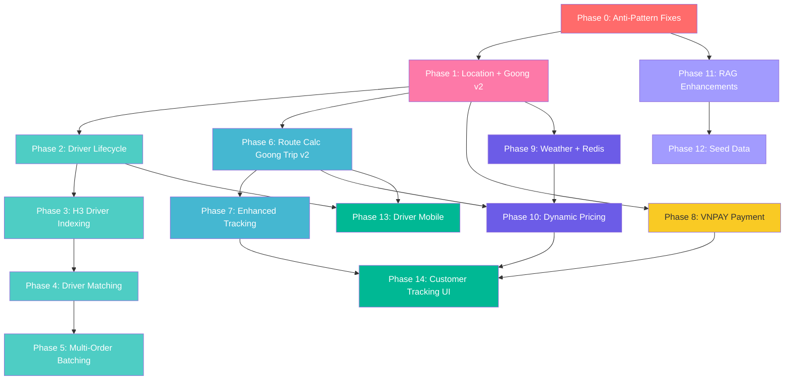

# Foodya V2 — System Analysis & Phased Implementation Plan

> **Audience**: Human developer/architect. This is a reasoning-heavy plan with justifications for every design decision, algorithm choice, and pattern selection. Each sub-task includes a prompt you can hand to a simple coding agent.

---

## Part 1: Current System Deep Analysis

### 1.1 Data Model Assessment

The current v1 data model is **well-structured** for a clean architecture monolith. Key entities:

| Entity | Table | Status | Notes |
|--------|-------|--------|-------|
| `UserAccount` | `user_accounts` | ✅ Solid | UUID PK, role-based (CUSTOMER, MERCHANT, DELIVERY, ADMIN) |
| `Restaurant` | `restaurants` | ✅ Solid | Has `h3_index_res9`, `geo_point` geography column, GIST index |
| `MenuCategory` | `menu_categories` | ✅ Solid | Linked to taxonomy system |
| `MenuItem` | `menu_items` | ✅ Solid | Soft-delete with `deleted_at`, `is_active` |
| `Order` | `orders` | ✅ Solid | State machine, idempotency key, COD payments |
| `OrderItem` | `order_items` | ✅ Solid | Snapshot pricing |
| `OrderPayment` | `order_payments` | ✅ Solid | Audit mirror of payment state |
| `DeliveryAssignment` | `delivery_assignments` | ✅ Solid | Links order → delivery user |
| `DeliveryLocationPoint` | `delivery_location_points` | ✅ Solid | GPS telemetry (lat, lng, heading, speed, recordedAt) |
| `Cart/CartItem` | `carts`, `cart_items` | ✅ Solid | Single active cart, single-restaurant enforcement |
| `OrderReview` | `order_reviews` | ✅ Solid | 1-5 stars, merchant reply chain |
| `NotificationLog` | `notification_logs` | ✅ Solid | Receiver-scoped, read tracking |
| `DeviceToken` | `device_tokens` | ✅ Solid | FCM token management |
| `AiCatalogChunk` | `ai_catalog_chunks` | ✅ Solid | pgvector embeddings for RAG |
| `AiChatMessage` | `ai_chat_messages` | ✅ Solid | Chat history with metadata |
| `SystemParameter` | `system_parameters` | ✅ Solid | Runtime config, versioned, audited |
| `AuditLog` | `audit_logs` | ✅ Solid | Admin action audit trail |
| `CategoryTaxonomy` | `category_taxonomies` | ✅ Solid | Hierarchical category system |

**Database extensions active**: `postgis`, `pg_trgm`, `pgvector` (with graceful fallback).

> [!NOTE]
> The data model is more complete than initially surveyed. H3 indexing (`h3_index_res9`) is already persisted on restaurants. PostGIS geography columns and GIST indexes are in place. The `delivery_location_points` table already stores telemetry data. pgvector is used for RAG embeddings.

#### What's Missing for V2

| Missing Entity/Column | Purpose | Priority |
|----------------------|---------|----------|
| `driver_shifts` table | Driver online/offline lifecycle tracking with shift history | HIGH |
| `driver_h3_cells` or `h3_index` on driver location | H3-indexed driver position for fast spatial lookup | HIGH |
| `order_batches` table | Multi-order batching for single driver | HIGH |
| `payment_transactions` table | VNPAY transaction lifecycle (initiate → callback → settle) | HIGH |
| `weather_cache` table (or Redis key) | H3 res8-keyed weather data cache | MEDIUM |
| `delivery_routes` table | Stored route polyline for driver navigation and customer tracking | MEDIUM |
| `location_name_mappings` table | Old → new Vietnamese administrative name migration | MEDIUM |

---

### 1.2 API Design Assessment

The API layer is **comprehensive** with 90+ endpoints across 27 controllers. Key findings:

#### ✅ Strengths
- Consistent role-scoped prefixes: `/api/v1/admin/**`, `/api/v1/merchant/**`, `/api/v1/customer/**`, `/api/v1/delivery/**`
- Standardized response wrapper `ApiSuccessResponse<T>` / `ApiErrorResponse`
- Rate limiting on auth and AI endpoints
- Idempotency key on order creation
- STOMP WebSocket for real-time order tracking
- JWT with access/refresh token rotation
- Global exception handler
- OpenAPI/Swagger documentation
- Request tracing via `X-Trace-Id`
- Custom bean validation (`@StrongPassword`, `@AtLeastOneField`, `@FieldsMatch`)
- API-layer mappers separating REST DTOs from application DTOs

#### ⚠️ Anti-Patterns Found

| # | Anti-Pattern | Location | Severity |
|---|-------------|----------|----------|
| 1 | **Header injection for actor identity** | `AdminSystemParameterController` extracts `X-User-Role` and `X-Actor-Id` from headers instead of `CurrentUser.userId(authentication)` | 🔴 HIGH — potential spoofing |
| 2 | **Duplicate endpoints** | `GET /delivery/orders/assignments` AND `/assigned` (same handler); `POST /tracking-points` AND `/locations` (identical logic) | 🟡 MEDIUM — confusing API surface |
| 3 | **HTTP status code inconsistency** | Admin create operations return 200 instead of 201; inconsistent 204 vs 200 for mutations | 🟡 MEDIUM — API contract confusion |
| 4 | **PATCH with NOT NULL fields** | `UpdateMenuCategoryApiRequest`, `UpdateMenuItemApiRequest` mark all fields `@NotNull` — forces PUT semantics on a PATCH verb | 🟡 MEDIUM — semantic mismatch |
| 5 | **Missing pagination** | `GET /customer/orders` and `GET /merchant/.../orders` return unbounded lists | 🟡 MEDIUM — performance risk |
| 6 | **Missing password validation** | `AdminUserCreateRequest` lacks `@StrongPassword` unlike all other password fields | 🟡 MEDIUM — security gap |
| 7 | **Inconsistent response wrapping** | Some controllers return `ResponseEntity<ApiSuccessResponse<T>>`, others return bare `ApiSuccessResponse<T>` | 🟢 LOW — works but inconsistent |
| 8 | **Inconsistent min delivery distance** | Admin API allows `maxDeliveryKm >= 0.0` but merchant API requires `>= 0.1` | 🟢 LOW — edge case |

---

### 1.3 Architecture & Flow Assessment

#### ✅ Clean Architecture Compliance
- ArchUnit tests enforce strict layer boundaries (domain → application → infrastructure → interfaces)
- Legacy package guardrails prevent regressions
- Application layer is framework-free (no `@Service`, `@Transactional`, no Jakarta validation)
- Port/adapter pattern properly isolates external dependencies
- Services explicitly wired in `AppConfig.java`

#### ✅ Order Lifecycle Flow
```
PENDING → ACCEPTED → ASSIGNED → PREPARING → DELIVERING → SUCCESS
                                                         ↘ FAILED
Any of first 3 states → CANCELLED
```
State transitions are enforced. Notifications fire on each transition to correct receivers.

#### ✅ Checkout Flow
1. Customer reviews cost (dry-run) → Goong Maps route distance → fee calculation
2. Customer places order with `Idempotency-Key` → cart validated → order created → cart cleared → merchant notified

#### ✅ RAG Chatbot Flow
1. Customer sends message → system gathers context (weather via H3 res8 cache, budget parsing, conversation history)
2. pgvector similarity search on `ai_catalog_chunks` → candidate menu items
3. Gemini generates response grounded strictly on catalog data
4. Response filtered for hallucinations → fallback to rule-scored candidates if needed

#### ✅ Real-Time Tracking Flow
1. Driver posts GPS telemetry via REST → stored in `delivery_location_points`
2. Backend publishes via STOMP to `/user/{customerId}/queue/orders/{orderId}/tracking`
3. Customer receives live coordinates via WebSocket

---

### 1.4 Test Suite Assessment

| Category | Count | Quality |
|----------|-------|---------|
| Architecture rules (ArchUnit) | 1 class, 15+ rules | ✅ Excellent |
| REST integration tests | 16 classes | ✅ Good coverage |
| Application service unit tests | 4 classes | ⚠️ Sparse |
| Infrastructure adapter tests | 4 classes | ⚠️ Sparse |
| OpenAPI smoke test | 1 class | ✅ Innovative — hits every route |
| Domain unit tests | 0 | ❌ Gap |
| Concurrency tests | 0 | ❌ Gap |
| WebSocket E2E tests | 0 | ❌ Gap |

**Test anti-patterns**: Manual JSON string payloads, repeated cleanup boilerplate, string-based JSON parsing in some tests.

---

## Part 2: V2 Phased Implementation Plan

### Phase Overview

```mermaid
gantt
    title Foodya V2 Implementation Phases
    dateFormat X
    axisFormat %s
    
    section Foundation
    Phase 0: Anti-Pattern Fixes               :p0, 0, 3
    Phase 1: Location + Goong v2 Migration    :p1, 3, 6
    
    section Driver Core
    Phase 2: Driver Lifecycle (Grab Toggle)    :p2, 6, 8
    Phase 3: H3 Driver Indexing               :p3, 8, 11
    Phase 4: Driver Matching                  :p4, 11, 14
    Phase 5: Multi-Order Batching             :p5, 14, 17
    
    section Routing & Tracking
    Phase 6: Route Calc (Goong Trip v2)       :p6, 6, 9
    Phase 7: Enhanced Live Tracking           :p7, 9, 12
    
    section Payment
    Phase 8: VNPAY Integration                :p8, 6, 10
    
    section Dynamic Pricing
    Phase 9: Weather Service + Redis Cache    :p9, 6, 9
    Phase 10: Dynamic Cost Engine             :p10, 9, 12
    
    section AI/RAG
    Phase 11: RAG Enhancements                :p11, 3, 7
    Phase 12: Seed Data + Metadata            :p12, 7, 10
    
    section Mobile
    Phase 13: Driver Mobile Screens           :p13, 17, 23
    Phase 14: Customer Tracking UI            :p14, 23, 26
```



> [!NOTE]
> **Phase 1 (Location + Goong v2) is first** because it's low-risk, unlikely to change, and establishes the v2 API foundation that Phases 6, 7, 8, 9, 10, and all geocoding depend on. Everything built on Goong Maps inherits v2 from day one.

---

## Phase 0: Anti-Pattern Fixes & Foundation Cleanup

> **WHY FIRST**: Technical debt compounds. Fixing anti-patterns before adding features prevents the new code from inheriting bad patterns. Every subsequent phase builds on clean foundations.

### 0.1 Fix Header Injection Vulnerability

**Problem**: `AdminSystemParameterController` reads actor identity from HTTP headers (`X-User-Role`, `X-Actor-Id`) instead of the authenticated JWT principal. An attacker who can reach the endpoint could spoof any user/role.

**Fix**: Replace header extraction with `CurrentUser.userId(authentication)` — the same pattern used by every other controller.

**Why this is the best approach**: The JWT principal is cryptographically verified. HTTP headers are not. This is the standard Spring Security pattern already used in 26/27 controllers.

```
Agent Prompt 0.1:
"In file AdminSystemParameterController.java, find all usages of @RequestHeader('X-User-Role') 
and @RequestHeader('X-Actor-Id'). Replace them with CurrentUser.userId(authentication) and 
CurrentUser.role(authentication) following the exact same pattern used in AdminGovernanceController.java. 
The Authentication parameter should be added to the method signatures. Run the existing tests to verify."
```

---

### 0.2 Remove Duplicate Endpoints

**Problem**: Three pairs of duplicate endpoints exist:
1. `GET /delivery/orders/assignments` AND `/assigned` → same handler
2. `POST /delivery/orders/{id}/tracking-points` AND `/locations` → identical logic
3. `PATCH /merchant/reviews/{id}/response` AND `POST /merchant/reviews/{id}/replies` AND `PATCH /merchant/review-replies/{id}` → overlapping review response logic

**Fix**: Keep the canonical endpoint, deprecate (then remove) the duplicate. Choose the more RESTful name.

**Why**: Duplicate endpoints double the attack surface, confuse API consumers, and make OpenAPI docs misleading. Pick the name that best follows REST conventions.

**Canonical choices**:
- Keep `GET /assignments` (noun-based, clearer intent than `assigned` adjective)
- Keep `POST /tracking-points` (resource creation semantics, 201 status)
- Keep `POST /reviews/{id}/replies` + `PATCH /review-replies/{id}` (separate create vs update)

```
Agent Prompt 0.2:
"In DeliveryOrderController.java:
1. Remove the handler method mapped to GET /assigned (keep /assignments)
2. Remove the handler method mapped to POST /{orderId}/locations (keep /tracking-points), 
   update the kept method to return 201 Created
In MerchantReviewController.java:
3. Remove the PATCH /reviews/{reviewId}/response endpoint (keep MerchantReviewReplyController's 
   POST /reviews/{id}/replies and PATCH /review-replies/{id})
Update the OpenApiLiveRouteSmokeIntegrationTests if it references removed paths. Run all tests."
```

---

### 0.3 Fix HTTP Status Code Inconsistencies

**Problem**: Creation endpoints (`AdminGovernanceController.createRestaurant`, `AdminUserController.create`) return `200 OK` instead of `201 Created`.

**Fix**: Add `HttpStatus.CREATED` to all creation responses.

```
Agent Prompt 0.3:
"In AdminGovernanceController.java and AdminUserController.java, find all @PostMapping methods 
that create resources but return 200 OK. Change them to return ResponseEntity with HttpStatus.CREATED (201). 
Follow the pattern used in MerchantCatalogController.createRestaurant. Run tests after."
```

---

### 0.4 Fix PATCH Validation Semantics

**Problem**: PATCH endpoints use DTOs with `@NotNull`/`@NotBlank` on every field, making them behave like PUT (full replacement required).

**Fix**: Remove `@NotNull`/`@NotBlank` from PATCH DTO fields. Add null-check logic in the service layer to only update non-null fields (true partial update).

**Why PATCH should allow partial updates**: RFC 5789 defines PATCH as a partial update. Requiring all fields defeats the purpose and forces clients to re-send unchanged data.

```
Agent Prompt 0.4:
"In UpdateMenuCategoryApiRequest.java and UpdateMenuItemApiRequest.java (in interfaces/rest/dto/):
1. Remove @NotNull and @NotBlank annotations from all fields
2. Make all fields Optional or nullable (use the pattern already in UpdateProfileApiRequest if it exists)
3. In the corresponding service methods, add null-checks: only update fields that are non-null in the request
4. Verify with existing PATCH integration tests"
```

---

### 0.5 Add Missing Pagination

**Problem**: `GET /customer/orders` and `GET /merchant/.../orders` return unbounded lists.

**Fix**: Add `page` and `size` query parameters with Spring Data's `Pageable`, following the pattern already used in admin endpoints.

```
Agent Prompt 0.5:
"Add pagination support (page, size query params) to:
1. CustomerOrderController.listOrders - add Pageable parameter, return paged response with PageMetadata
2. MerchantOrderController.listOrders - add Pageable parameter, return paged response
Follow the exact pagination pattern used in AdminGovernanceController (which already has page/size).
Update the corresponding use case ports and service implementations to accept Pageable.
Run existing order integration tests."
```

---

### 0.6 Fix Password Validation Gap

```
Agent Prompt 0.6:
"In AdminUserCreateRequest.java, add the @StrongPassword annotation to the password field, 
matching the pattern used in RegisterApiRequest.java. Run AdminUserGovernanceIntegrationTests."
```

---

### 0.7 Standardize Response Wrapper Pattern

```
Agent Prompt 0.7:
"Audit all controllers in interfaces/rest/. Find controllers that return plain ApiSuccessResponse<T> 
instead of ResponseEntity<ApiSuccessResponse<T>>. Standardize them all to use ResponseEntity wrapping, 
which gives explicit control over HTTP status codes. The controllers to fix are likely: 
CustomerAiChatController, CustomerOrderLifecycleController, DeliveryOrderController, MerchantOrderController.
Run all integration tests after."
```

---

## Phase 1: Location Name Migration + Goong Maps v2 API Migration

> **WHY FIRST**:
> 1. **Low risk, high stability**: Location mappings and API endpoint URLs are factual data — they don't involve complex business logic and are unlikely to need rework.
> 2. **Foundation for everything Goong**: Phases 6 (routing), 7 (tracking), 9 (weather), 10 (dynamic pricing), and all geocoding calls depend on Goong Maps. Migrating to v2 once means every subsequent phase builds on the correct API from day one.
> 3. **Admin boundary consistency**: Goong v2 returns post-2024 Vietnamese admin names. If we build routing/geocoding on v1 and migrate later, we'd need to re-test everything. Doing it first avoids that.
> 4. **Enables `has_deprecated_administrative_unit` param**: v2 supports this flag for backward compatibility during data migration — we need it while old addresses still exist in the DB.
>
> **Migration strategy: Mapping table + batch update + on-read normalization + v2 endpoint migration**:
> 1. Build a mapping table of old_name → new_name for all affected provinces/districts/wards
> 2. Batch-update existing addresses in the database
> 3. Add on-read normalization so old names in external data (user input, API responses) get mapped
> 4. Migrate ALL Goong API calls from v1 to v2 endpoints

### 1.1 Location Mapping Table

```
Agent Prompt 1.1:
"Create Flyway migration V20__create_location_name_mappings.sql:

CREATE TABLE location_name_mappings (
    id              UUID PRIMARY KEY DEFAULT gen_random_uuid(),
    entity_type     VARCHAR(20) NOT NULL,  -- PROVINCE, DISTRICT, WARD
    old_name        VARCHAR(200) NOT NULL,
    new_name        VARCHAR(200) NOT NULL,
    old_code        VARCHAR(20),
    new_code        VARCHAR(20),
    province_code   VARCHAR(20),           -- parent province (for district/ward context)
    district_code   VARCHAR(20),           -- parent district (for ward context)
    effective_date  DATE NOT NULL DEFAULT '2024-01-01',
    notes           TEXT,
    created_at      TIMESTAMPTZ NOT NULL DEFAULT now()
);

CREATE UNIQUE INDEX idx_location_mapping_old ON location_name_mappings (entity_type, old_name, province_code, district_code);
CREATE INDEX idx_location_mapping_new ON location_name_mappings (entity_type, new_name);

-- Seed with known changes (example — you need to research the actual changes):
INSERT INTO location_name_mappings (entity_type, old_name, new_name, province_code, notes) VALUES
('DISTRICT', 'Quận 2', 'Thành phố Thủ Đức', '79', 'Merged Q2, Q9, Thủ Đức into Thủ Đức City'),
('DISTRICT', 'Quận 9', 'Thành phố Thủ Đức', '79', 'Merged Q2, Q9, Thủ Đức into Thủ Đức City'),
('DISTRICT', 'Quận Thủ Đức', 'Thành phố Thủ Đức', '79', 'Merged Q2, Q9, Thủ Đức into Thủ Đức City');
-- Add more based on actual Vietnamese administrative changes"
```

### 1.2 Migration Script for Existing Data

```
Agent Prompt 1.2:
"Create Java Flyway migration V21__migrate_address_location_names.java:

This migration should:
1. Read all entries from location_name_mappings
2. For each mapping, UPDATE addresses (or any table with ward/district/province text fields):
   UPDATE addresses 
   SET district = :newName, updated_at = now()
   WHERE district = :oldName AND province_code = :provinceCode

3. Also update restaurant addresses
4. Log the number of rows updated for each mapping

Also create an AddressNormalizationPort in application/ports/out/ with method:
- String normalizeLocationName(String entityType, String name, String parentCode)

Create AddressNormalizationAdapter that queries location_name_mappings to normalize on-the-fly.
Use this in:
- Address creation/update service (normalize before save)
- Goong geocoding adapter (normalize API responses before returning)"
```

### 1.3 Migrate ALL Goong Maps API Calls to v2

> This is the critical sub-phase. After this, every Goong call in the codebase is on v2.

```
Agent Prompt 1.3:
"Migrate GoongMapsClient.java (at infrastructure/integration/GoongMapsClient.java) to v2:

Current state:
- routeDistanceRaw() calls GET /Direction (v1)
- reverseGeocodeRaw() calls GET /Geocode (v1)

Changes:
1. Update routeDistanceRaw() endpoint from '/Direction' to '/v2/direction'
   The v2 direction endpoint is: GET /v2/direction with same params (origin, destination, vehicle, api_key)
   Response format is Google-compatible (same as v1), so GoongRouteDistanceAdapter parsing still works.

2. Update reverseGeocodeRaw() endpoint from '/Geocode' to '/v2/geocode'
   Add optional param: has_deprecated_administrative_unit=false (default — use new names)
   Response format is the same.

3. Add NEW method for Trip API v2 (will be used by Phase 6 for multi-stop routing):
   public String tripRouteRaw(String origin, String destination, String waypoints, String vehicle, boolean roundtrip)
   Calls: GET /v2/trip with params:
   - origin: 'lat,lng'
   - destination: 'lat,lng'
   - waypoints: 'lat1,lng1;lat2,lng2;...' (semicolon-separated, can be null/empty)
   - vehicle: 'bike' (default for delivery drivers)
   - roundtrip: false (one-way delivery routes)
   - api_key: from ApiSecretsProvider

4. Add response normalization: when Goong returns location names, pass them through 
   AddressNormalizationPort to ensure old names are mapped to new names.

5. Add retry logic with exponential backoff (3 attempts, 1s/2s/4s delays)
   Use Spring's RetryTemplate or simple loop with Thread.sleep.

Run GoongRouteDistanceAdapterIntegrationTests and ProfileIntegrationTests to verify 
the v2 migration doesn't break existing functionality."
```

### 1.4 Update Geocoding Adapter

```
Agent Prompt 1.4:
"Update GeoAdapter.java (at infrastructure/adapter/integration/GeoAdapter.java):
1. Inject AddressNormalizationPort
2. After parsing Goong's reverse geocode response, normalize district/province/ward names
   through AddressNormalizationPort before returning
3. This ensures any address returned from Goong uses the current (post-2024) naming

Run ProfileIntegrationTests to verify the location-address endpoint still works."
```

---

## Phase 2: Driver Lifecycle System (Grab-Style Toggle)

> **WHY**: The driver is the most critical actor in a delivery platform. Before we can do intelligent matching (Phase 3) or batching (Phase 4), we need a proper driver state machine with shift management.

### 1.1 Design: Driver Online/Offline Toggle (Grab-Style)

**Current state**: Driver has only `isAvailable` boolean. No session tracking, no status history, no lifecycle management.

**UX Model**: Exactly like the Grab driver app — a single big "GO" button that toggles online/offline. No concept of scheduled shifts. Driver can toggle unlimited times per day.

**V2 Driver States**:
```
OFFLINE ←→ ONLINE → ON_DELIVERY → ONLINE (auto, after delivery completes)
ONLINE → BUSY (max orders reached) → ONLINE (auto, when order delivered)
Any → SUSPENDED (admin action) → OFFLINE (after unsuspend)

"Last trip" mode: driver taps offline while ON_DELIVERY → finishes current order → auto OFFLINE
```

**Internal session tracking**: Each OFFLINE→ONLINE toggle creates a `DriverOnlineSession` record (table: `driver_online_sessions`). When driver goes offline, `ended_at` is filled. This is invisible to the driver — they just see a toggle. The session data powers analytics (total online hours, utilization rate, earnings per hour).

**Why a proper state machine instead of boolean flags**:
- **Auditability**: We need to know when drivers went online/offline for earnings, SLA, and analytics
- **Concurrency safety**: Boolean flags can't prevent race conditions during driver assignment
- **Business rules**: Different states allow different operations (can't assign order to OFFLINE driver)
- **Analytics**: Session duration, active time, utilization rate
- **"Last trip" support**: Boolean can't express "going offline after current delivery"

### 1.2 Database Changes

New table `driver_online_sessions` (internal name — driver never sees "session" or "shift"):
```sql
CREATE TABLE driver_online_sessions (
    id              UUID PRIMARY KEY DEFAULT gen_random_uuid(),
    driver_user_id  UUID NOT NULL REFERENCES user_accounts(id),
    status          VARCHAR(20) NOT NULL DEFAULT 'ONLINE',
    -- ONLINE: accepting orders (driver toggled ON)
    -- ON_DELIVERY: currently delivering
    -- BUSY: at max concurrent orders
    -- GOING_OFFLINE: "last trip" mode — finish current, then auto-offline
    -- OFFLINE: toggled off (ended_at set)
    -- SUSPENDED: admin-blocked
    started_at      TIMESTAMPTZ NOT NULL DEFAULT now(),
    ended_at        TIMESTAMPTZ,       -- filled when driver toggles OFF or auto-offline
    last_heartbeat  TIMESTAMPTZ NOT NULL DEFAULT now(),
    h3_index_res9   VARCHAR(20),       -- current H3 cell (updated with location)
    current_lat     DOUBLE PRECISION,
    current_lng     DOUBLE PRECISION,
    active_order_count INTEGER NOT NULL DEFAULT 0,
    max_concurrent_orders INTEGER NOT NULL DEFAULT 2,
    created_at      TIMESTAMPTZ NOT NULL DEFAULT now()
);

CREATE INDEX idx_driver_sessions_active ON driver_online_sessions (driver_user_id, status) WHERE ended_at IS NULL;
CREATE INDEX idx_driver_sessions_h3 ON driver_online_sessions (h3_index_res9) WHERE status IN ('ONLINE', 'ON_DELIVERY') AND ended_at IS NULL;
```

**Why H3 index on the session table**: The session is the "live" record. Querying available drivers means querying active sessions. Having H3 on the session avoids joining to a separate location table for the hot path.

**Why `max_concurrent_orders`**: Different drivers (motorcycle vs car) or experienced vs new drivers may handle different order counts. This is configurable per-driver.

**Why `GOING_OFFLINE` state**: Like Grab's "Last trip" — driver wants to go offline but is mid-delivery. System completes the current delivery, then auto-transitions to OFFLINE. Without this state, the driver must wait until delivery completes to tap the toggle.

```
Agent Prompt 1.1:
"Create a new Flyway migration file V20__create_driver_online_sessions_table.sql in 
backend/src/main/resources/db/migration/. Create the driver_online_sessions table with columns:
id (UUID PK), driver_user_id (UUID FK to user_accounts), status (VARCHAR(20) DEFAULT 'ONLINE'), 
started_at (TIMESTAMPTZ DEFAULT now()), ended_at (TIMESTAMPTZ nullable), 
last_heartbeat (TIMESTAMPTZ DEFAULT now()), h3_index_res9 (VARCHAR(20) nullable), 
current_lat (DOUBLE PRECISION nullable), current_lng (DOUBLE PRECISION nullable),
active_order_count (INTEGER DEFAULT 0), max_concurrent_orders (INTEGER DEFAULT 2), 
created_at (TIMESTAMPTZ DEFAULT now()).
Add indexes: idx_driver_sessions_active on (driver_user_id, status) WHERE ended_at IS NULL,
idx_driver_sessions_h3 on (h3_index_res9) WHERE status IN ('ONLINE','ON_DELIVERY') AND ended_at IS NULL.
Add CHECK constraint: status IN ('ONLINE','ON_DELIVERY','BUSY','GOING_OFFLINE','OFFLINE','SUSPENDED')."
```

### 1.3 Domain Entity

```
Agent Prompt 1.2:
"Create a new domain entity DriverOnlineSession.java in backend/src/main/java/com/foodya/backend/domain/entities/.
Fields: id (UUID), driverUserId (UUID), status (DriverSessionStatus enum), startedAt (Instant), 
endedAt (Instant nullable), lastHeartbeat (Instant), h3IndexRes9 (String nullable), 
currentLat (Double nullable), currentLng (Double nullable), activeOrderCount (int), 
maxConcurrentOrders (int), createdAt (Instant).

Create enum DriverSessionStatus in domain/value_objects/ with values: 
ONLINE, ON_DELIVERY, BUSY, GOING_OFFLINE, OFFLINE, SUSPENDED.

Add domain methods to DriverOnlineSession:
- toggleOnline() - creates new session, sets startedAt, status=ONLINE
- toggleOffline() - if ONLINE: sets endedAt, status=OFFLINE. If ON_DELIVERY: status=GOING_OFFLINE (last trip mode)
- startDelivery() - validates ONLINE, increments activeOrderCount, transitions to ON_DELIVERY
- completeDelivery() - decrements activeOrderCount. If GOING_OFFLINE and count==0: auto set OFFLINE+endedAt. If count==0: back to ONLINE.
- updateLocation(lat, lng, h3Index) - updates position and heartbeat
- canAcceptOrder() - returns true if status is ONLINE or ON_DELIVERY (not GOING_OFFLINE) and activeOrderCount < maxConcurrentOrders
- suspend() / unsuspend() - admin actions

Each transition method should throw IllegalStateException with descriptive message for invalid transitions.
Do NOT add any JPA annotations — this is a pure domain entity."
```

### 1.4 Port, Adapter, Service

```
Agent Prompt 1.3:
"Create outbound port DriverOnlineSessionPort.java in application/ports/out/ with methods:
- Optional<DriverOnlineSession> findActiveSession(UUID driverUserId)
- DriverOnlineSession save(DriverOnlineSession session)
- List<DriverOnlineSession> findOnlineDriversInH3Cells(Set<String> h3Indexes)
- void updateHeartbeat(UUID sessionId, Instant now)

Create JPA persistence entity DriverOnlineSessionJpaEntity.java in infrastructure/persistence/entity/ 
mapping to 'driver_online_sessions' table. Create JpaDriverOnlineSessionRepository extending JpaRepository 
in infrastructure/persistence/. Create DriverOnlineSessionPersistenceAdapter implementing 
DriverOnlineSessionPort with domain↔JPA mapping.

Create/update inbound port DriverLifecycleUseCase.java in application/ports/in/ with methods:
- DriverOnlineSession toggleOnline(UUID driverUserId)    // tap GO button
- DriverOnlineSession toggleOffline(UUID driverUserId)   // tap GO button again (or 'last trip' if delivering)
- DriverOnlineSession updateLocation(UUID driverUserId, double lat, double lng)
- DriverOnlineSession getActiveSession(UUID driverUserId)

Create DriverLifecycleService implementing DriverLifecycleUseCase in application/usecases/.
Wire in AppConfig.java. Run architecture tests to verify layer compliance."
```

### 1.5 REST Endpoints

```
Agent Prompt 1.4:
"Create a new DeliveryStatusController.java (Grab-style toggle endpoints):
- POST /api/v1/delivery/status/online → toggleOnline (driver taps GO — returns session with 200)
- POST /api/v1/delivery/status/offline → toggleOffline (driver taps GO again — returns session summary)
  If driver is mid-delivery: returns 200 with status=GOING_OFFLINE and message 'Will go offline after current delivery'
- GET /api/v1/delivery/status → getActiveSession (returns current status: ONLINE/ON_DELIVERY/GOING_OFFLINE/OFFLINE)
- PUT /api/v1/delivery/status/location → updateLocation (accepts lat, lng in body, updates H3 cell)

Create request/response DTOs: 
- DriverStatusApiResponse: status (enum), startedAt, activeOrderCount, currentLat, currentLng, h3Cell
- UpdateDriverLocationApiRequest: lat (@NotNull, @Min(-90) @Max(90)), lng (@NotNull, @Min(-180) @Max(180))

Add these paths to SecurityConfig with DELIVERY role access.
Write an integration test DeliveryStatusIntegrationTests.java covering:
- Toggle online (first tap) → expect ONLINE
- Get status → expect ONLINE  
- Update location → expect updated coordinates
- Toggle offline (tap again while ONLINE) → expect OFFLINE
- Toggle offline while ON_DELIVERY → expect GOING_OFFLINE
- Toggle online when already online → expect 409 Conflict
- Get status when offline → expect OFFLINE"
```

---

## Phase 3: H3 Geospatial Driver Indexing

> **WHY H3 instead of PostGIS ST_DWithin or geohash**:
> 1. **Uniform cell area**: H3 hexagons have nearly equal area at each resolution (unlike geohash rectangles which distort near poles). For Vietnam (~10°N), this matters less, but H3 also avoids the "edge effect" where nearby points fall in different geohash prefixes.
> 2. **k-ring neighbor queries**: H3's `kRing(cell, k)` returns all cells within k hexagonal rings — this maps perfectly to "find drivers within N km" with predictable cell counts. PostGIS `ST_DWithin` requires a spatial index scan which is slower for high-frequency updates (driver locations update every 3-5 seconds).
> 3. **Resolution math**: At resolution 9, each hexagon is ~0.1 km² (105m edge). k-ring of 3 covers ~1.2 km radius. k-ring of 15 covers ~5 km. This gives us precise radius control.
> 4. **Cache-friendly**: H3 cells are strings — perfect as Redis keys for O(1) lookup of "which drivers are in this cell".
> 5. **Already in use**: The codebase already uses H3 res9 for restaurant indexing. Consistency.

### 2.1 Add H3 Java Library

```
Agent Prompt 2.1:
"Add the Uber H3 Java library to backend/pom.xml. The Maven coordinates are:
<dependency>
    <groupId>com.uber</groupId>
    <artifactId>h3</artifactId>
    <version>4.1.1</version>
</dependency>
Verify the dependency resolves with 'mvn dependency:resolve'."
```

### 2.2 Create H3 Utility Port and Adapter

**Why a port instead of static utility**: Architecture rules forbid application layer depending on infrastructure. H3 is a third-party library — it belongs behind a port for testability and layer compliance.

```
Agent Prompt 2.2:
"Create outbound port H3IndexPort.java in application/ports/out/ with methods:
- String latLngToCell(double lat, double lng, int resolution)
- Set<String> kRing(String h3Index, int ringSize)
- double cellToLatitude(String h3Index)
- double cellToLongitude(String h3Index)
- boolean isValid(String h3Index)
- int estimateRingSizeForRadiusKm(double radiusKm, int resolution)

Create H3IndexAdapter.java in infrastructure/adapter/ implementing H3IndexPort.
Use com.uber.h3core.H3Core (singleton, thread-safe).

For estimateRingSizeForRadiusKm: at resolution 9, edge length is ~174m. 
Ring size k covers approximately k * 174m * sqrt(3) radius. So:
  k = ceil(radiusKm * 1000 / (174 * 1.732))
  k ≈ ceil(radiusKm * 3.32)
  
For resolution 8 (edge ~461m): k ≈ ceil(radiusKm * 1.25)

Wire H3IndexAdapter in AppConfig. Run architecture tests."
```

### 2.3 Integrate H3 into Driver Location Updates

```
Agent Prompt 2.3:
"Update DriverLifecycleService.updateLocation() to:
1. Compute H3 res9 index from (lat, lng) using H3IndexPort
2. Store the H3 index on the DriverShift entity
3. The DriverShiftPort.save() will persist it

Update DriverShiftPort to add:
- List<DriverShift> findAvailableDriversInCells(Set<String> h3Cells)
  (query: h3_index_res9 IN :cells AND status IN ('ONLINE') AND ended_at IS NULL AND active_order_count < max_concurrent_orders)

This query is the foundation for Phase 3 driver matching."
```

---

## Phase 4: Intelligent Driver Matching

> **WHY this matching algorithm**: The problem is a variant of the **assignment problem** — assign the best available driver to a new order. For a single order, we need to find the nearest available driver who can accept it. The approach:
>
> 1. **H3 k-ring expansion** (not full-table scan): Start with k=3 (~1km), expand to k=10 (~3km), then k=20 (~6km). Stop when we find candidates or hit max radius. This is O(cells_in_ring * drivers_per_cell) instead of O(all_drivers).
> 2. **Haversine distance ranking**: Among candidates in the ring, rank by actual Haversine distance (not Euclidean — we're on a sphere, and at Vietnam's latitude the error is ~0.3% which matters for fairness).
> 3. **Score-based selection**: Distance isn't the only factor. We also consider: driver rating, current order count, time since last delivery (freshness), vehicle type match. This prevents always assigning to the closest driver (which burns them out).

### 3.1 Matching Algorithm

```
Agent Prompt 3.1:
"Create outbound port DriverMatchingPort.java in application/ports/out/ with method:
- Optional<DriverMatchResult> findBestDriver(DriverMatchRequest request)

Create value objects in domain/value_objects/:
- DriverMatchRequest: restaurantLat, restaurantLng, customerLat, customerLng, orderValue (BigDecimal)
- DriverMatchResult: driverUserId (UUID), shiftId (UUID), distanceKm (double), score (double)

Create DriverMatchingAdapter.java in infrastructure/adapter/ implementing DriverMatchingPort.
Algorithm:
1. Compute restaurant H3 res9 cell
2. Start with kRing(cell, 3) — ~1km radius
3. Query DriverShiftPort.findAvailableDriversInCells(cells) 
4. If no candidates, expand to kRing(cell, 10), then kRing(cell, 20)
5. If still none, return Optional.empty()
6. For each candidate, compute Haversine distance from restaurant
7. Score each candidate:
   score = (1.0 / (1.0 + distanceKm)) * 0.5       // proximity weight 50%
         + (driverRating / 5.0) * 0.2                // quality weight 20%  
         + (1.0 - activeOrders/maxOrders) * 0.2       // capacity weight 20%
         + (minutesSinceLastDelivery / 60.0) * 0.1    // fairness weight 10% (capped at 1.0)
8. Return highest-scoring driver

Add Haversine formula as a utility method in the adapter:
  a = sin²(Δlat/2) + cos(lat1) * cos(lat2) * sin²(Δlng/2)
  c = 2 * atan2(√a, √(1-a))
  d = R * c  (R = 6371 km)

Wire in AppConfig. Write a unit test with mock data verifying scoring logic."
```

### 3.2 Auto-Assignment on Order ACCEPTED

> **WHY auto-assign on ACCEPTED (not PENDING)**: The merchant must confirm they can fulfill the order before we search for a driver. Searching on PENDING wastes driver availability if the merchant rejects.

```
Agent Prompt 3.2:
"Update the OrderLifecycleService (or equivalent use case that handles order status transitions).
When an order transitions from PENDING to ACCEPTED:
1. Trigger driver matching via DriverMatchingPort.findBestDriver()
2. If a driver is found:
   a. Create DeliveryAssignment linking order → driver
   b. Update order status to ASSIGNED
   c. Update driver's DriverShift: increment activeOrderCount, status → ON_DELIVERY if was ONLINE
   d. Send push notification to driver (via existing NotificationLogPort)
   e. Send push notification to customer ('Driver assigned')
3. If no driver found:
   a. Log the failure
   b. Order stays in ACCEPTED (a background retry job will be added in Phase 4)
   c. Consider sending merchant a 'Searching for driver' notification

This should be transactional. Use the existing domain event pattern if available, or direct service calls.
Run OrderLifecycleIntegrationTests to verify no regression."
```

---

## Phase 5: Multi-Order Batching

> **WHY batch multiple orders to one driver**: In dense urban areas (HCMC, Hanoi), multiple orders from nearby restaurants going to nearby customers can be efficiently combined. This:
> 1. Reduces driver idle time between deliveries
> 2. Reduces total distance driven (shared route segments)
> 3. Increases driver earnings per hour
> 4. Reduces platform cost per delivery
>
> **Algorithm choice: Greedy Nearest-Neighbor with constraints** instead of full VRP solver:
> - Full Vehicle Routing Problem (VRP) is NP-hard. For real-time assignment (< 1 second), we need a heuristic.
> - Google OR-Tools or VROOM are overkill for 2-3 order batches.
> - Greedy nearest-neighbor with max detour constraint gives 85-90% of optimal with O(n²) complexity.
> - **Key constraint**: Maximum detour for any customer ≤ 15 minutes. If batching adds more than 15 min to any customer's delivery, don't batch.

### 4.1 Batching Data Model

```
Agent Prompt 4.1:
"Create Flyway migration V21__create_order_batches_table.sql:

CREATE TABLE order_batches (
    id              UUID PRIMARY KEY DEFAULT gen_random_uuid(),
    driver_user_id  UUID NOT NULL REFERENCES user_accounts(id),
    shift_id        UUID NOT NULL REFERENCES driver_shifts(id),
    status          VARCHAR(20) NOT NULL DEFAULT 'ACTIVE',
    pickup_sequence TEXT[],      -- ordered array of order UUIDs for pickup
    delivery_sequence TEXT[],    -- ordered array of order UUIDs for delivery
    total_distance_km DOUBLE PRECISION,
    estimated_duration_minutes INTEGER,
    created_at      TIMESTAMPTZ NOT NULL DEFAULT now(),
    completed_at    TIMESTAMPTZ
);

CREATE INDEX idx_order_batches_driver ON order_batches (driver_user_id, status) WHERE status = 'ACTIVE';

ALTER TABLE delivery_assignments ADD COLUMN batch_id UUID REFERENCES order_batches(id);
ALTER TABLE delivery_assignments ADD COLUMN sequence_in_batch INTEGER;
CREATE INDEX idx_delivery_assignments_batch ON delivery_assignments (batch_id);"
```

### 4.2 Batching Algorithm

```
Agent Prompt 4.2:
"Create BatchOrderMatchingPort in application/ports/out/ with method:
- Optional<BatchMatchResult> findBatchOpportunity(UUID orderId, double restaurantLat, double restaurantLng, 
  double customerLat, double customerLng)

Create value object BatchMatchResult: batchId (UUID), driverUserId (UUID), 
additionalDetourKm (double), estimatedDetourMinutes (int), 
updatedPickupSequence (List<UUID>), updatedDeliverySequence (List<UUID>)

Create BatchOrderMatchingAdapter implementing the port:
Algorithm:
1. Find all drivers with active_order_count > 0 AND active_order_count < max_concurrent_orders 
   within H3 kRing(restaurant_cell, 5)
2. For each such driver, get their current batch and existing order locations
3. For each candidate batch, compute:
   a. Current route distance (sum of legs in current sequence)
   b. New route distance with the new order inserted at optimal position
   c. Detour = new_distance - current_distance
   d. Max additional time for any existing customer = detour / average_speed * 60
4. Filter: max_additional_time <= 15 minutes (configurable via SystemParameter)
5. Score: lower detour + higher driver score = better batch
6. Return best batch opportunity, or empty if none qualifies

The optimal insertion position can be found by trying all possible positions in pickup_sequence 
and delivery_sequence (with constraint: pickup before delivery for same order) and choosing 
the one with minimum total distance increase.

For 2-3 orders, this is at most 6 positions to try — O(1) per candidate driver.
Wire in AppConfig."
```

### 4.3 Integrate Batching into Assignment Flow

```
Agent Prompt 4.3:
"Update the order assignment logic (from Phase 3) to try batching first:
1. When order transitions to ACCEPTED, first call BatchOrderMatchingPort.findBatchOpportunity()
2. If a batch opportunity exists with detour < threshold:
   a. Add order to existing batch (update pickup/delivery sequences)
   b. Create DeliveryAssignment with batch_id and sequence_in_batch
   c. Notify driver of new order in batch
   d. Notify customer with updated ETA
3. If no batch opportunity, fall back to single-driver matching (Phase 3 logic)
4. If neither works, order stays in ACCEPTED for retry

Add system parameters:
- 'driver.batch.max_detour_minutes' = 15
- 'driver.batch.max_orders_per_batch' = 3
- 'driver.batch.search_radius_km' = 2.0"
```

---

## Phase 6: Route Calculation & Storage (Goong Trip API v2)

> **WHY Goong Trip API v2** (not Directions API, not OSRM):
> 1. **Multi-stop optimization built-in**: Trip API v2 (`/v2/trip`) optimizes waypoint order for shortest total route — critical for multi-order batching (Phase 5). Directions API only does A→B.
> 2. **Vietnam-specific road rules**: Accounts for one-way streets, turning bans, time-based vehicle restrictions unique to Vietnamese cities.
> 3. **v2 already migrated**: Phase 1 migrated GoongMapsClient to v2 and added the `tripRouteRaw()` method. This phase just creates the port/adapter/service layer on top.
> 4. **Traffic-aware**: Real-time traffic data for ETA estimation.
> 5. **Google Maps-compatible response**: Returns encoded polylines, legs, distance/duration in Google-compatible format — Flutter's `google_maps_flutter` can render directly.
>
> **WHY store routes**: 
> 1. Customer tracking needs to show the planned route + driver position on it
> 2. Driver needs turn-by-turn display
> 3. Route distance is needed for delivery fee (already used in checkout)
> 4. Stored routes enable "snap driver GPS to road" for smoother tracking visualization

### 5.1 Route Storage

```
Agent Prompt 5.1:
"Create Flyway migration V22__create_delivery_routes_table.sql:

CREATE TABLE delivery_routes (
    id              UUID PRIMARY KEY DEFAULT gen_random_uuid(),
    order_id        UUID NOT NULL REFERENCES orders(id),
    batch_id        UUID REFERENCES order_batches(id),
    encoded_polyline TEXT NOT NULL,           -- Google encoded polyline format
    distance_meters  INTEGER NOT NULL,
    duration_seconds INTEGER NOT NULL,
    waypoints       JSONB,                    -- [{lat, lng, type: 'PICKUP'|'DROPOFF', orderId}]
    calculated_at   TIMESTAMPTZ NOT NULL DEFAULT now(),
    is_active       BOOLEAN NOT NULL DEFAULT true
);

CREATE INDEX idx_delivery_routes_order ON delivery_routes (order_id) WHERE is_active = true;
CREATE INDEX idx_delivery_routes_batch ON delivery_routes (batch_id) WHERE is_active = true;"
```

### 6.2 Route Calculation Port and Adapter (Goong Trip API v2)

**Goong Trip API v2** — already added to GoongMapsClient in Phase 1.3 (`tripRouteRaw()` method).
This phase creates the clean-architecture port/adapter/service layer on top.

```
Agent Prompt 6.2:
"Create outbound port RouteCalculationPort.java in application/ports/out/ with methods:
- RouteResult calculateRoute(LatLng origin, LatLng destination, List<LatLng> waypoints)
  Returns: encodedPolyline (String), distanceMeters (int), durationSeconds (int), legs (List<RouteLeg>)
- RouteResult calculateOptimizedRoute(LatLng origin, LatLng destination, List<LatLng> waypoints)
  Same as above but Trip API optimizes waypoint order (for batching — driver doesn't specify order)

Create GoongTripAdapter.java in infrastructure/adapter/integration/ implementing RouteCalculationPort:
1. Build origin/destination strings: 'lat,lng'
2. Build waypoints string by joining intermediate points with ';'
3. Call goongMapsClient.tripRouteRaw(origin, destination, waypoints, 'bike', false)
   (tripRouteRaw was added in Phase 1.3)
4. Parse response JSON:
   - overview_polyline.points → encodedPolyline
   - routes[0].legs → iterate for distance.value (meters), duration.value (seconds)
   - Sum all legs for total distance/duration
5. Return RouteResult

Create value objects in domain/value_objects/: RouteResult, RouteLeg, LatLng.
Wire in AppConfig. Run architecture tests."
```

### 5.3 Generate Route on Driver Assignment

```
Agent Prompt 5.3:
"Update the order assignment logic to calculate and store a route when a driver is assigned:
1. After driver is assigned to order (or batch):
   a. Build waypoints list: [driver_current_location, restaurant_location, customer_location]
   b. For batches: [driver_location, pickup1, pickup2, ..., dropoff1, dropoff2, ...]
   c. Call RouteCalculationPort.calculateRoute(waypoints)
   d. Save DeliveryRoute entity with encoded polyline, distance, duration
   e. Include route info in the assignment notification to driver
   f. Update order's estimated delivery time based on route duration

Create domain entity DeliveryRoute in domain/entities/.
Create DeliveryRoutePort in application/ports/out/ with save/findByOrderId methods.
Create persistence adapter. Wire everything."
```

### 5.4 REST Endpoints for Route

```
Agent Prompt 5.4:
"Add endpoints:
- GET /api/v1/delivery/orders/{orderId}/route → returns DeliveryRoute (polyline, waypoints, distance, ETA)
  (for driver to display navigation)
- GET /api/v1/customer/orders/{orderId}/route → returns DeliveryRoute 
  (for customer to see planned route on tracking map)

Create response DTO DeliveryRouteApiResponse with fields: encodedPolyline, distanceMeters, 
durationSeconds, waypoints (list of {lat, lng, type}), calculatedAt.

Both endpoints should verify the requesting user owns the order (customer) or is assigned to it (driver).
Write integration tests."
```

---

## Phase 7: Enhanced Real-Time Tracking

> **WHY enhance the existing STOMP-based tracking**:
> The current system stores telemetry and publishes via STOMP. What's missing:
> 1. **Route-snapped position**: Raw GPS coordinates jump around. Snapping to the planned route gives smooth visualization.
> 2. **ETA updates**: As the driver progresses, ETA should update based on remaining route distance.
> 3. **Customer-facing tracking page**: Mobile needs a map with route polyline + driver marker + live updates.
>
> **Why NOT use raw GPS for display**: GPS accuracy on phones is 5-15m in urban areas, 30m+ indoors. Points will appear to "jump" across buildings. Route-snapping projects the GPS point onto the nearest segment of the planned route, giving a smooth progression along the road.

### 6.1 Route-Snap Algorithm

```
Agent Prompt 6.1:
"Create utility class RouteSnapper in infrastructure/adapter/geo/ (or behind a port if architecture tests require).

Algorithm (point-to-polyline projection):
1. Decode the Google encoded polyline into a list of LatLng points
2. For each consecutive pair of points (segment), compute:
   a. Project the GPS point onto the line segment using perpendicular projection
   b. If projection falls outside segment, use the nearest endpoint
   c. Calculate distance from GPS point to projected point
3. Return the projected point on the segment with minimum distance
4. Also return: progress (0.0-1.0) along the full route, remaining distance

This is a standard computational geometry operation. The projection formula:
  Given segment AB and point P:
  t = dot(AP, AB) / dot(AB, AB)  // parameter along segment
  t = clamp(t, 0, 1)
  projected = A + t * (B - A)

Decode polyline using standard Google polyline decoder (implement or use library).
Write unit test with a simple 3-point polyline and GPS points near and far from route."
```

### 6.2 Enhanced Tracking Publication

```
Agent Prompt 6.2:
"Update the STOMP tracking publication (StompOrderTrackingUpdatePublisherAdapter or equivalent) to:
1. When a tracking point is received:
   a. Snap it to the delivery route using RouteSnapper
   b. Calculate remaining distance and updated ETA
   c. Publish enriched tracking data via STOMP:
      {
        raw: {lat, lng, heading, speed},
        snapped: {lat, lng, progress},  // route-snapped position
        route: {remainingDistanceMeters, remainingDurationSeconds, estimatedArrival},
        timestamp: '...'
      }
2. Only snap if a delivery route exists for the order. Otherwise publish raw.

Update OrderTrackingPointResponse DTO to include snapped coordinates and ETA fields."
```

---

## Phase 8: VNPAY Payment Gateway

> **WHY VNPAY**:
> 1. VNPAY is the most widely adopted payment gateway in Vietnam (60%+ market share for online payments)
> 2. Supports VNPay QR, bank cards (ATM/Visa/Master), e-wallets
> 3. Well-documented API with sandbox environment
> 4. Required for moving beyond COD
>
> **Design pattern: Payment Strategy + State Machine**:
> - Strategy pattern: `PaymentGatewayPort` interface with `VNPayAdapter` implementation (can add MoMo, ZaloPay later)
> - State machine: `PENDING → PROCESSING → COMPLETED / FAILED → REFUNDED`
> - Idempotency: Use order's existing idempotency key as VNPAY `vnp_TxnRef`

### 7.1 Payment Transaction Model

```
Agent Prompt 7.1:
"Create Flyway migration V23__create_payment_transactions_table.sql:

CREATE TABLE payment_transactions (
    id                  UUID PRIMARY KEY DEFAULT gen_random_uuid(),
    order_id            UUID NOT NULL REFERENCES orders(id),
    payment_method      VARCHAR(30) NOT NULL,       -- VNPAY_QR, VNPAY_ATM, VNPAY_CARD, COD
    gateway             VARCHAR(20) NOT NULL,        -- VNPAY, COD, MOMO (future)
    gateway_txn_ref     VARCHAR(100) UNIQUE,         -- vnp_TxnRef
    gateway_txn_no      VARCHAR(100),                -- vnp_TransactionNo (from VNPAY response)
    amount              BIGINT NOT NULL,             -- amount in VND (smallest unit)
    currency            VARCHAR(3) NOT NULL DEFAULT 'VND',
    status              VARCHAR(20) NOT NULL DEFAULT 'PENDING',
    gateway_response    JSONB,                       -- raw gateway response for audit
    return_url          TEXT,
    payment_url         TEXT,                        -- URL to redirect customer to
    ip_address          VARCHAR(45),
    created_at          TIMESTAMPTZ NOT NULL DEFAULT now(),
    updated_at          TIMESTAMPTZ NOT NULL DEFAULT now(),
    completed_at        TIMESTAMPTZ
);

CREATE INDEX idx_payment_txn_order ON payment_transactions (order_id);
CREATE INDEX idx_payment_txn_ref ON payment_transactions (gateway_txn_ref);
ALTER TABLE payment_transactions ADD CONSTRAINT chk_payment_status 
    CHECK (status IN ('PENDING','PROCESSING','COMPLETED','FAILED','REFUNDED','CANCELLED'));"
```

### 7.2 Payment Gateway Port

```
Agent Prompt 7.2:
"Create outbound port PaymentGatewayPort.java in application/ports/out/:
- PaymentInitResult initiate(PaymentInitRequest request)
  // Returns: paymentUrl (redirect URL), transactionRef, transactionId
- PaymentVerifyResult verifyCallback(Map<String, String> params)
  // Verifies VNPAY callback signature, returns: verified (boolean), transactionRef, responseCode, amount
- PaymentQueryResult queryTransaction(String transactionRef)
  // Query VNPAY for transaction status

Create value objects:
- PaymentInitRequest: orderId, amount, orderInfo, returnUrl, ipAddress, paymentMethod (VNPAY_QR/ATM/CARD)
- PaymentInitResult: paymentUrl, transactionRef, transactionId
- PaymentVerifyResult: verified, transactionRef, responseCode, amount, bankCode
- PaymentQueryResult: status, amount, transactionNo

Create VNPayPaymentAdapter implementing PaymentGatewayPort in infrastructure/adapter/payment/:

VNPAY integration steps:
1. initiate(): 
   - Build VNPAY params: vnp_Version=2.1.0, vnp_Command=pay, vnp_TmnCode, vnp_Amount (amount*100),
     vnp_CurrCode=VND, vnp_TxnRef (unique), vnp_OrderInfo, vnp_Locale=vn, vnp_ReturnUrl, vnp_IpAddr,
     vnp_CreateDate (yyyyMMddHHmmss), vnp_OrderType=food_delivery
   - Sort params alphabetically, build query string
   - Generate HMAC-SHA512 signature using vnp_HashSecret
   - Append vnp_SecureHash to query string
   - Build payment URL: https://sandbox.vnpayment.vn/paymentv2/vpcpay.html?{queryString}

2. verifyCallback():
   - Extract vnp_SecureHash from params
   - Remove vnp_SecureHash and vnp_SecureHashType from params
   - Sort remaining params, build hash data string
   - Compute HMAC-SHA512 with HashSecret
   - Compare computed hash with received hash
   - Check vnp_ResponseCode == '00' for success

Add config properties: foodya.vnpay.tmn-code, foodya.vnpay.hash-secret, foodya.vnpay.url
Wire in AppConfig."
```

### 7.3 Payment Use Case

```
Agent Prompt 7.3:
"Create inbound port PaymentUseCase.java in application/ports/in/:
- PaymentInitResult initiatePayment(UUID orderId, String paymentMethod, String ipAddress, String returnUrl)
- PaymentResult handleCallback(Map<String, String> callbackParams)
- PaymentStatus getPaymentStatus(UUID orderId)

Create PaymentService implementing PaymentUseCase in application/usecases/:
1. initiatePayment():
   a. Load order, verify it's in PENDING payment status
   b. Create PaymentTransaction record (status=PENDING)
   c. Call PaymentGatewayPort.initiate()
   d. Update PaymentTransaction with paymentUrl and txnRef
   e. Return payment URL to redirect customer

2. handleCallback():
   a. Call PaymentGatewayPort.verifyCallback()
   b. If verified and responseCode==00:
      - Update PaymentTransaction status → COMPLETED
      - Update order payment_status → PAID (via existing order_payments mirror logic)
      - Trigger order flow (if needed)
   c. If failed:
      - Update PaymentTransaction status → FAILED
      - Update order payment_status → FAILED

Create REST endpoints:
- POST /api/v1/customer/orders/{orderId}/pay → initiate payment, return {paymentUrl}
- GET /api/v1/payments/vnpay/callback → handle VNPAY IPN callback (public, verified by signature)
- GET /api/v1/payments/vnpay/return → handle customer return from VNPAY (redirect to app)
- GET /api/v1/customer/orders/{orderId}/payment-status → query payment status

Add VNPAY callback URLs to SecurityConfig public whitelist.
Write integration test for the full payment flow (mock VNPAY response)."
```

### 7.4 Mobile Payment Flow

```
Agent Prompt 7.4:
"In the Flutter mobile app, update the checkout flow:
1. After order creation, if payment method is not COD:
   a. Call POST /customer/orders/{orderId}/pay
   b. Receive paymentUrl in response
   c. Open paymentUrl in a WebView (use webview_flutter package)
   d. Handle the return URL — detect when VNPAY redirects back to app
   e. On return, query payment status and show result
2. Add payment method selection on checkout screen (COD, VNPAY QR, VNPAY ATM, VNPAY Card)
3. Add a PaymentWebViewPage that:
   - Loads the VNPAY payment URL
   - Listens for navigation to return URL
   - Closes WebView and shows success/failure
   
Add webview_flutter to pubspec.yaml dependencies.
Create features/payment/ directory with bloc, pages, and data layer."
```

---

## Phase 9: Weather Service & Redis Caching

> **WHY Redis for caching (not Caffeine/EhCache)**:
> 1. **Shared cache**: Multiple backend instances (horizontal scaling) need shared cache. In-process caches (Caffeine) are per-JVM.
> 2. **TTL management**: Redis has native TTL per key. Weather data should expire after 10-15 minutes (per SRS BR36).
> 3. **Data structures**: Redis Hashes are perfect for "H3 cell → weather data" mapping. Redis GEO for driver locations.
> 4. **Driver location**: Driver positions update every 3-5 seconds. Writing to PostgreSQL on every update is wasteful. Redis is the hot layer; periodic batch-sync to DB for persistence.
>
> **WHY cache by H3 res8 (not res9)**:
> Weather doesn't change every 100m. H3 res8 cells are ~0.74 km² — weather is uniform within that area.
> Using res8 means fewer API calls to OpenWeather (shared across many res9 cells within the same res8 cell).

### 8.1 Add Redis Dependencies

```
Agent Prompt 8.1:
"Add to backend/pom.xml:
<dependency>
    <groupId>org.springframework.boot</groupId>
    <artifactId>spring-boot-starter-data-redis</artifactId>
</dependency>

Add to docker-compose.yml a Redis service:
  redis:
    image: redis:7-alpine
    ports:
      - '6379:6379'
    volumes:
      - redis_data:/data

Add to volumes section: redis_data:

Add to application.yml:
  spring.data.redis.host: localhost
  spring.data.redis.port: 6379
  
Run 'mvn dependency:resolve' to verify."
```

### 8.2 Redis Cache Port and Adapter

```
Agent Prompt 8.2:
"Create outbound port CachePort.java in application/ports/out/ with methods:
- <T> Optional<T> get(String key, Class<T> type)
- <T> void put(String key, T value, Duration ttl)
- void evict(String key)
- <T> void putHash(String hashKey, String field, T value, Duration ttl)
- <T> Optional<T> getHash(String hashKey, String field, Class<T> type)
- Map<String, T> getHashAll(String hashKey, Class<T> type)

Create RedisCacheAdapter implementing CachePort in infrastructure/adapter/cache/.
Use Spring Data Redis's RedisTemplate with JSON serialization (Jackson2JsonRedisSerializer).

Create RedisConfig.java in infrastructure/config/ that configures:
- RedisTemplate<String, Object> with Jackson serializer
- Connection factory from spring.data.redis properties

Wire in AppConfig. 
Write a simple integration test (if Redis is available) or unit test with mock."
```

### 8.3 Weather Caching Service

> The existing system already has weather context for the RAG chatbot (OpenWeather integration, H3 res8 cache key per SRS BR36). This phase adds the Redis backing.

```
Agent Prompt 8.3:
"Create (or update existing) WeatherCacheService in application/usecases/:

Method: WeatherContext getWeatherForLocation(double lat, double lng)
1. Compute H3 res8 cell from (lat, lng) via H3IndexPort
2. Build cache key: 'weather:h3:' + h3Res8Cell
3. Try CachePort.get(key, WeatherContext.class)
4. If cache hit and not expired → return cached
5. If cache miss:
   a. Call WeatherPort (existing OpenWeather adapter) to fetch weather
   b. CachePort.put(key, weatherData, Duration.ofMinutes(15))
   c. Return weather data

The WeatherContext value object should contain:
- temperature (double, Celsius)
- humidity (int, %)
- condition (String: 'CLEAR', 'RAIN', 'HEAVY_RAIN', 'STORM', 'CLOUDY', 'HOT')
- windSpeed (double, m/s)
- isRaining (boolean)
- rainIntensity (double, mm/h)
- fetchedAt (Instant)

Update any existing weather integration to use this caching layer.
Wire in AppConfig."
```

### 8.4 Driver Location Redis Caching

> **WHY Redis GEO for driver locations**:
> Redis GEO uses a sorted set with geohash scores. `GEOSEARCH` can find all members within a radius in O(N+log(M)) where N is the number of results and M is the total members. For driver lookup, this is blazing fast.
> But we ALSO store H3 index because our matching algorithm uses H3 k-ring queries (which are precise hex rings, not circles). So we maintain both:
> - Redis GEO: for radius-based proximity queries
> - Redis Hash: for H3-indexed lookups

```
Agent Prompt 8.4:
"Create outbound port DriverLocationCachePort.java in application/ports/out/ with methods:
- void updateDriverLocation(UUID driverUserId, double lat, double lng, String h3Res9)
- Optional<DriverCachedLocation> getDriverLocation(UUID driverUserId)
- List<DriverCachedLocation> getDriversInRadius(double centerLat, double centerLng, double radiusKm)
- List<DriverCachedLocation> getDriversInH3Cells(Set<String> h3Cells)
- void removeDriver(UUID driverUserId)

Create value object DriverCachedLocation: driverUserId, lat, lng, h3Res9, updatedAt

Create RedisDriverLocationAdapter implementing DriverLocationCachePort in infrastructure/adapter/cache/:

Implementation strategy:
1. updateDriverLocation():
   - GEOADD 'driver:locations:geo' lng lat driverUserId.toString()
   - HSET 'driver:locations:h3:' + h3Res9 driverUserId.toString() '{lat,lng,updatedAt}'
   - SET 'driver:location:' + driverUserId '{lat,lng,h3Res9,updatedAt}' EX 300
   - If driver moved to new H3 cell, HDEL old cell entry

2. getDriversInH3Cells():
   - For each cell: HGETALL 'driver:locations:h3:' + cell
   - Merge results, filter by updatedAt (stale > 5 min → ignore)

3. getDriversInRadius():
   - GEOSEARCH 'driver:locations:geo' FROMLONLAT centerLng centerLat BYRADIUS radiusKm km ASC

4. removeDriver():
   - ZREM 'driver:locations:geo' driverUserId
   - HDEL old H3 cell entry
   - DEL 'driver:location:' + driverUserId

Wire in AppConfig.
Update DriverLifecycleService.updateLocation() to also update Redis cache.
Update DriverMatchingAdapter to query from Redis cache first (fall back to DB)."
```

---

## Phase 10: Dynamic Cost Engine

> **WHY dynamic pricing**:
> 1. **Weather surcharge**: Drivers face higher risk and slower speeds in rain. Compensating them retains supply.
> 2. **Route-based fee**: SRS already specifies Goong route distance-based fee. But we can add time-of-day and congestion factors.
> 3. **Demand surge**: Peak hours (11am-1pm, 6pm-8pm) with low driver supply should price higher to attract drivers.
>
> **Design: Chain of Responsibility pattern for fee modifiers**:
> Each modifier is a pure function: `(baseFee, context) → adjustedFee`. They chain:
> ```
> baseFee → DistanceModifier → WeatherModifier → DemandSurgeModifier → finalFee
> ```
> **Why Chain of Responsibility**: Modifiers are independent, composable, and can be enabled/disabled via SystemParameter. Adding a new modifier requires zero changes to existing ones.

### 9.1 Fee Calculation Engine

```
Agent Prompt 9.1:
"Create the dynamic pricing engine in application/usecases/ (or a dedicated subpackage):

Create interface DeliveryFeeModifier in application/ports/in/:
  BigDecimal apply(BigDecimal currentFee, DeliveryFeeContext context)
  String name()
  int order()  // for sequencing

Create value object DeliveryFeeContext:
  routeDistanceKm (double), routeDurationMinutes (int), 
  weatherContext (WeatherContext), 
  hourOfDay (int), dayOfWeek (DayOfWeek),
  restaurantLat/Lng, customerLat/Lng

Create implementations in application/usecases/pricing/:

1. DistanceFeeModifier (order=1):
   - Uses existing formula from SystemParameter:
     if distance <= base_distance_km: baseFee
     else: baseFee + (distance - baseDistance) * feePerKm
   - This REPLACES the current inline calculation

2. WeatherFeeModifier (order=2):
   - If weather.isRaining: fee *= 1.15 (15% surcharge)
   - If weather.condition == HEAVY_RAIN: fee *= 1.30 (30%)
   - If weather.condition == STORM: fee *= 1.50 (50%)
   - Surcharge rates from SystemParameter: 'pricing.weather.rain_multiplier' etc.

3. DemandSurgeFeeModifier (order=3):
   - Query active order count in H3 kRing(restaurant, 10) vs available driver count
   - If demand/supply ratio > 2.0: fee *= 1.20
   - If ratio > 3.0: fee *= 1.40
   - Rates from SystemParameter
   - This is OPTIONAL and can be disabled via SystemParameter 'pricing.surge.enabled'

Create DeliveryFeeCalculator in application/usecases/:
  BigDecimal calculate(DeliveryFeeContext context):
    1. Get base fee from SystemParameter
    2. Chain all enabled modifiers (sorted by order())
    3. Apply each modifier sequentially
    4. Cap at SystemParameter 'pricing.max_delivery_fee'
    5. Return final fee with breakdown

Create DeliveryFeeBreakdown value object:
  baseFee, distanceFee, weatherSurcharge, surgeSurcharge, totalFee, 
  List<FeeComponent> components (name, amount, description)

Wire modifiers and calculator in AppConfig."
```

### 9.2 Integrate Dynamic Pricing into Checkout

```
Agent Prompt 9.2:
"Update the order checkout flow (OrderCheckoutService or equivalent) to use DeliveryFeeCalculator:
1. In the cost review (dry-run) endpoint:
   a. Build DeliveryFeeContext with route distance, weather (from cache), current time
   b. Call DeliveryFeeCalculator.calculate(context)
   c. Return fee breakdown to customer so they see: base fee, weather surcharge, surge, total

2. In the actual order creation:
   a. Recalculate fee at order creation time (may have changed since review)
   b. Store breakdown components in order metadata or a new order_fee_breakdown JSONB column
   c. This provides transparency and audit trail

3. Update OrderCostReviewResponse to include fee breakdown:
   Add fields: feeBreakdown (list of {name, amount, description})
   Example: [{name: 'Base Delivery', amount: 15000}, {name: 'Rain Surcharge (+15%)', amount: 2250}]

Add system parameters for all pricing constants (seed with defaults).
Run checkout integration tests."
```

---

## Phase 11: Advanced RAG System Enhancements

> **Current state analysis**: The RAG system is already functional with:
> - pgvector embeddings in `ai_catalog_chunks`
> - Google AI Studio (`text-embedding-004`) for embedding generation
> - Gemini for LLM generation
> - Weather context, budget parsing, conversation history
> - Catalog grounding with hallucination filtering
>
> **What needs improvement for "super advanced" RAG**:
>
> 1. **Hybrid search**: Vector similarity alone misses exact keyword matches. Combine pgvector cosine similarity with `pg_trgm` trigram text search for hybrid retrieval. Research shows hybrid search improves recall by 15-30% over vector-only.
>
> 2. **Re-ranking**: After initial retrieval, re-rank candidates using a cross-encoder or LLM-based relevance scoring. This reduces false positives where semantically similar but contextually wrong items surface.
>
> 3. **Chunking strategy**: Menu items should be chunked with rich context (restaurant info, cuisine type, price range, ingredients, dietary tags). Current chunks may lack sufficient context for the LLM to reason about.
>
> 4. **Query expansion**: User says "something spicy for 2 people under 200k" — expand to: [spicy, hot, chili] × [2-person portion, sharing size] × [budget: 100k per person].
>
> 5. **Conversation-aware retrieval**: Use the last 3-5 messages to understand evolving preferences, not just the current query.
>
> 6. **Metadata filtering**: Before vector search, pre-filter by: is_available=true, restaurant is open, within delivery radius, price within budget. This reduces the candidate pool and improves relevance.

### 10.1 Hybrid Search Implementation

```
Agent Prompt 10.1:
"Update the RAG retrieval to use hybrid search (vector + text):

In the existing AI catalog search logic (likely in AiChatService or equivalent):

1. Vector search (existing):
   SELECT *, 1 - (embedding <=> query_embedding) AS vector_score
   FROM ai_catalog_chunks
   WHERE is_active = true
   ORDER BY embedding <=> query_embedding
   LIMIT 20

2. Text search (new, using pg_trgm already available):
   SELECT *, similarity(content, :query) AS text_score
   FROM ai_catalog_chunks
   WHERE is_active = true
   AND (content ILIKE '%' || :query || '%' OR similarity(content, :query) > 0.1)
   ORDER BY similarity(content, :query) DESC
   LIMIT 20

3. Reciprocal Rank Fusion (RRF) to combine:
   For each document d:
     rrf_score = 1/(k + rank_vector(d)) + 1/(k + rank_text(d))
   where k = 60 (standard RRF constant)
   
   Sort by rrf_score descending, take top 10

Why RRF instead of weighted average: RRF is rank-based, not score-based. Vector similarity 
scores and trigram similarity scores are on different scales and distributions. RRF normalizes 
by rank, making combination fair without manual weight tuning.

Update the repository port to support both queries. Create a HybridSearchResult value object."
```

### 10.2 Query Expansion

```
Agent Prompt 10.2:
"Create a QueryExpansionService in application/usecases/ai/:

Method: ExpandedQuery expand(String userQuery, List<ChatMessage> history)

Implementation:
1. Extract intent signals from the query:
   - Budget: regex for Vietnamese money patterns (\\d+k, \\d+ nghìn, \\d+ ngàn, dưới \\d+)
   - Group size: regex for (\\d+ người, cho \\d+ bạn, nhóm \\d+)
   - Cuisine preferences: match against known cuisine types
   - Dietary: detect (chay/vegetarian, không cay/not spicy, halal, etc.)
   - Meal type: (sáng/breakfast, trưa/lunch, tối/dinner, ăn vặt/snack)

2. From conversation history (last 3 messages):
   - Extract any preferences mentioned but not in current query
   - Example: if user previously said 'tôi thích đồ Nhật' and now says 'gợi ý món gì đi', 
     carry forward the Japanese cuisine preference

3. Build ExpandedQuery with:
   - originalQuery
   - keywords (expanded Vietnamese + English synonyms for key terms)
   - budgetRange (min, max VND)
   - groupSize
   - cuisinePreferences
   - dietaryRestrictions
   - mealType
   - deliveryRadiusKm

This is a rule-based expansion (not LLM-based) for speed. LLM-based expansion adds latency.
Vietnamese food vocabulary mapping should be a static map:
  'cay' → ['spicy', 'hot', 'chili', 'ớt']
  'ngọt' → ['sweet', 'dessert', 'chè']
  'mặn' → ['savory', 'salty']
  etc.

Create the vocabulary map as a resource file or constant."
```

### 10.3 Metadata Pre-Filtering

```
Agent Prompt 10.3:
"Update the RAG retrieval pipeline to pre-filter before vector search:

In the catalog search flow:
1. After query expansion, build metadata filters:
   - is_available = true (always)
   - restaurant.is_open = true (based on current time + operating hours)
   - restaurant.h3_index_res9 IN kRing(customer_h3, k) where k = radius-based
   - price <= budget_per_person (if budget extracted)
   - cuisine_type IN preferredCuisines (if specified)

2. Apply these as SQL WHERE clauses BEFORE the vector similarity search
   This means the vector search query becomes:
   
   SELECT *, 1 - (embedding <=> :query_embedding) AS score
   FROM ai_catalog_chunks c
   JOIN menu_items mi ON c.menu_item_id = mi.id
   JOIN restaurants r ON mi.restaurant_id = r.id
   WHERE mi.is_active = true AND mi.is_available = true
   AND r.is_active = true AND r.is_approved = true
   AND (r.h3_index_res9 = ANY(:h3Cells))  -- nearby restaurants only
   AND (:maxPrice IS NULL OR mi.price <= :maxPrice)
   ORDER BY embedding <=> :query_embedding
   LIMIT 20

3. This dramatically reduces the search space and improves relevance

Update the port/adapter to accept filter parameters."
```

### 10.4 Re-Ranking with LLM

```
Agent Prompt 10.4:
"Add a re-ranking step after hybrid retrieval:

After getting top-10 candidates from hybrid search:
1. Build a re-ranking prompt for Gemini:
   'Given the user query: {query}
    User context: {budget, group_size, preferences, weather}
    
    Score each candidate item from 0-10 for relevance:
    1. {item_name} - {restaurant} - {price} - {description}
    2. ...
    
    Respond with JSON: [{index: 1, score: 8, reason: '...'}, ...]'

2. Parse LLM response, sort by score
3. Take top 5 for final recommendation
4. Include the 'reason' in the chat response for explainability

Why use LLM for re-ranking instead of a cross-encoder model:
- We're already using Gemini for generation — one more API call adds ~500ms
- Cross-encoder models need to be hosted/served — infrastructure overhead
- Gemini can consider ALL context (weather, budget, group size) simultaneously
- For a food delivery app, 4-5 second total response time is acceptable (SRS NFR11: median <= 4s)

Add configurable toggle: 'ai.chat.reranking.enabled' in SystemParameter
(can disable for faster responses if needed)"
```

---

## Phase 12: Seed Data Enhancement for RAG

> **WHY fix seeds**: The RAG system is only as good as its knowledge base. Current seeds lack:
> 1. Rich Vietnamese descriptions (the LLM needs context about Vietnamese dishes)
> 2. English translations (for bilingual users or English-language queries)
> 3. Ingredient lists (for dietary filtering)
> 4. Proper metadata tags (cuisine type, spicy level, meal type, dietary)
> 5. Allergen information
> 6. Cultural context (when is this dish typically eaten, what occasions)

### 11.1 Enrich Menu Item Seeds

```
Agent Prompt 11.1:
"Create a new Flyway migration V24__enrich_seed_menu_items_metadata.sql.

For each existing seeded menu item, UPDATE with rich metadata by adding/updating a 'metadata' JSONB column 
(if not exists, add it via ALTER TABLE first):

Example for 'Phở Bò':
UPDATE menu_items SET metadata = '{
  \"name_vi\": \"Phở Bò\",
  \"name_en\": \"Beef Pho Noodle Soup\",
  \"description_vi\": \"Phở bò truyền thống với nước dùng hầm xương 12 tiếng, bánh phở tươi, thịt bò tái và chín, rau thơm tươi\",
  \"description_en\": \"Traditional beef pho with 12-hour bone broth, fresh rice noodles, rare and well-done beef slices, fresh herbs\",
  \"ingredients\": [\"rice noodles\", \"beef\", \"bone broth\", \"onion\", \"ginger\", \"star anise\", \"cinnamon\", \"bean sprouts\", \"basil\", \"lime\", \"chili\"],
  \"allergens\": [\"gluten-free\"],
  \"dietary_tags\": [\"dairy-free\"],
  \"cuisine_type\": \"vietnamese\",
  \"meal_types\": [\"breakfast\", \"lunch\", \"dinner\"],
  \"spicy_level\": 1,
  \"serving_size\": \"1 person\",
  \"prep_time_minutes\": 10,
  \"calories_estimate\": 450,
  \"cultural_context_vi\": \"Phở là món ăn quốc hồn quốc túy của Việt Nam, thường ăn sáng hoặc khi trời se lạnh\",
  \"cultural_context_en\": \"Pho is Vietnam national dish, traditionally eaten for breakfast or when the weather is cool\",
  \"season_best\": [\"rainy\", \"cold\"],
  \"price_tier\": \"mid\"
}'::jsonb
WHERE name = 'Phở Bò' AND restaurant_id = (SELECT id FROM restaurants WHERE ... LIMIT 1);

Do this for ALL seeded menu items. Create rich, accurate metadata for each.
For the Ho Chi Minh City demo restaurants (Phở restaurant, Pizza restaurant, Sushi restaurant), 
add at least 10 items each with full bilingual metadata.

Focus on accuracy of Vietnamese food knowledge. Each item should have proper Vietnamese 
diacritics and culturally accurate descriptions."
```

### 11.2 Rebuild RAG Embeddings with Enriched Content

```
Agent Prompt 11.2:
"Create a background service or management endpoint to rebuild the ai_catalog_chunks table 
from enriched menu item data.

Rebuild process:
1. For each active menu item with metadata:
   a. Build chunk text combining:
      - name_vi + name_en
      - description_vi + description_en  
      - ingredients (comma-separated)
      - cuisine_type, meal_types
      - cultural_context_vi + cultural_context_en
      - price + price_tier
      - restaurant name + restaurant cuisine
      - weather suitability (season_best)
   
   b. Generate embedding via existing AiEmbeddingPort (Google text-embedding-004)
   
   c. Upsert into ai_catalog_chunks with:
      - content = constructed chunk text
      - embedding = generated vector
      - metadata JSONB = full menu item metadata + restaurant info
      - menu_item_id = FK
      - restaurant_id = FK

2. This should be idempotent — upsert by menu_item_id
3. Add an admin endpoint: POST /api/v1/admin/ai/rebuild-catalog-embeddings
4. Also trigger rebuild when menu items are created/updated (async/background)

The chunk text format is crucial for RAG quality. Bilingual content means the system 
can match both Vietnamese and English queries. Including cultural context helps the LLM 
give appropriate recommendations (e.g., suggesting phở on rainy days)."
```

### 11.3 RAG Knowledge Base Seeds

```
Agent Prompt 11.3:
"Create Flyway migration V25__seed_rag_knowledge_base.sql with general food knowledge 
that doesn't come from the catalog but helps the chatbot:

INSERT INTO knowledge_base entries (or ai_catalog_chunks with category='KNOWLEDGE') for:

1. Vietnamese food culture:
   - 'Ẩm thực Việt Nam theo mùa: Mùa mưa phù hợp với các món nóng như phở, bún bò, lẩu. 
     Mùa nóng phù hợp với gỏi cuốn, bún chả, nộm.'
   - English: 'Vietnamese seasonal food: Rainy season suits hot dishes like pho, bun bo, hotpot. 
     Hot season suits fresh spring rolls, bun cha, salads.'

2. Meal time conventions:
   - 'Giờ ăn sáng ở Việt Nam thường từ 6-9h (phở, bánh mì, xôi). Trưa 11-13h. Tối 18-21h.'

3. Budget guidance:
   - 'Mức giá ăn trưa bình dân ở TP.HCM: 30-60k. Trung bình: 60-120k. Cao cấp: 120k+'

4. Dietary information:
   - 'Các món chay phổ biến: cơm chay, phở chay, bún riêu chay, hủ tiếu chay'
   - 'Common vegetarian options: vegetarian rice, vegetarian pho, vegetarian bun rieu'

5. Group dining suggestions:
   - 'Đi nhóm 4-6 người nên gọi lẩu, BBQ, hoặc set ăn chia sẻ'

Each entry should have both Vietnamese and English versions, proper metadata tags.
Add at least 20 knowledge entries covering: seasons, meal times, budgets, dietary, 
group dining, popular food combinations, drink pairings, spiciness guide."
```

---

---

## Phase 13: Driver Mobile App Screens

> **WHY last for mobile**: Mobile work depends on backend APIs being ready. Phases 1-12 build all the backend infrastructure. Phase 13 consumes it from Flutter.
>
> **Feature-first structure** matching existing patterns.

### 13.1 Driver Home / Shift Management

```
Agent Prompt 13.1:
"Create a new feature module in mobile/lib/features/driver/:

Structure:
  driver/
  ├── data/
  │   ├── datasources/
  │   │   └── driver_remote_datasource.dart  
  │   ├── models/
  │   │   ├── driver_shift_model.dart
  │   │   └── driver_order_model.dart
  │   └── repositories/
  │       └── driver_repository_impl.dart
  ├── domain/
  │   ├── entities/
  │   │   ├── driver_shift.dart
  │   │   └── driver_order.dart
  │   ├── repositories/
  │   │   └── driver_repository.dart
  │   └── usecases/
  │       ├── start_shift_usecase.dart
  │       ├── end_shift_usecase.dart
  │       └── get_active_shift_usecase.dart
  └── presentation/
      ├── bloc/
      │   ├── driver_shift_bloc.dart
      │   ├── driver_shift_event.dart
      │   └── driver_shift_state.dart
      └── pages/
          ├── driver_home_page.dart      -- main screen with online/offline toggle
          ├── driver_earnings_page.dart   -- earnings summary
          └── widgets/
              ├── shift_toggle_button.dart
              ├── driver_stats_card.dart
              └── incoming_order_card.dart

The driver_home_page should show:
- Large toggle button (GO ONLINE / GO OFFLINE) with animation
- Current shift status and duration
- Current earnings for today
- Active order count
- Incoming order notifications

Add driver-specific route guard in go_router (only show driver screens if user role is DELIVERY).
Register DI bindings in injection.dart."
```

### 13.2 Driver Order Acceptance & Navigation

```
Agent Prompt 13.2:
"Create driver order management screens:

  driver/presentation/pages/
  ├── driver_order_detail_page.dart   -- order details with accept/reject
  ├── driver_navigation_page.dart     -- map with route + turn-by-turn
  └── driver_delivery_page.dart       -- delivery confirmation

driver_navigation_page.dart:
1. Display map (google_maps_flutter or flutter_map) with:
   - Decoded polyline from GET /delivery/orders/{id}/route 
   - Driver current position marker (blue dot)
   - Restaurant marker (orange) and customer marker (green)
   - Route line (blue polyline)
2. Implement background location tracking:
   - Use geolocator package for foreground tracking
   - POST location updates to /delivery/orders/{id}/tracking-points every 5 seconds
   - Update driver marker position on map
3. Show remaining distance and ETA at bottom panel
4. Navigation controls: 'Navigate' button opens Google Maps / Apple Maps for turn-by-turn

driver_delivery_page.dart:
1. 'Mark as Picked Up' button → PATCH order status to DELIVERING
2. 'Mark as Delivered' button → PATCH order status to SUCCESS
3. Photo upload option for proof of delivery

Add polyline decoding utility (decode Google encoded polyline to List<LatLng>)."
```

### 13.3 Driver Payment Screen (VNPAY Earnings)

```
Agent Prompt 13.3:
"Create driver earnings and payment screens:

  driver/presentation/pages/
  ├── driver_earnings_page.dart       -- earnings list with date filtering
  ├── driver_earnings_detail_page.dart -- individual delivery earnings breakdown
  └── widgets/
      ├── earnings_chart.dart          -- weekly/monthly chart
      └── earnings_summary_card.dart   -- today/week/month totals

driver_earnings_page.dart should:
1. Show earnings summary cards (today, this week, this month)
2. List of completed deliveries with earnings
3. Breakdown per delivery: delivery fee, tips, bonuses
4. Date range filter
5. Chart showing earnings trend

This consumes GET /delivery/earnings endpoint.
Add fl_chart package for charts if not already in pubspec.yaml."
```

---

## Phase 14: Customer Tracking UI Enhancement

### 14.1 Live Tracking Map

```
Agent Prompt 14.1:
"Enhance the existing order tracking page (in features/order/) to show a real-time map:

order_tracking_page.dart updates:
1. When order status is ASSIGNED or DELIVERING:
   a. Fetch route from GET /customer/orders/{id}/route
   b. Display map with:
      - Route polyline (decoded from encoded_polyline)
      - Restaurant marker
      - Customer (delivery) location marker
      - Driver position marker (updated in real-time)
   c. Connect to WebSocket (STOMP) at ws://{baseUrl}/api/v1/ws
      - Subscribe to /user/queue/orders/{orderId}/tracking
      - On each message: update driver marker position, update ETA display
   d. Show bottom panel with:
      - Driver name, photo, rating
      - Vehicle type and plate number
      - ETA countdown
      - 'Call Driver' and 'Message Driver' buttons (future)

2. When order status is PREPARING:
   - Show static map with restaurant location
   - Show preparation progress indicator

Add stomp_dart_client or web_socket_channel package.
Create a WebSocketService in core/network/ for STOMP connection management.
Handle reconnection logic (exponential backoff on disconnect)."
```

### 14.2 Payment Flow UI

```
Agent Prompt 14.2:
"Update the customer checkout flow to support VNPAY:

In features/cart/ or features/order/ checkout screen:
1. Add payment method selector:
   - COD (cash icon)
   - VNPAY QR (QR code icon) 
   - VNPAY ATM (bank card icon)
   - VNPAY International Card (Visa/Master icon)
   Each with description text

2. Show dynamic fee breakdown on checkout:
   - Subtotal: xxx VND
   - Delivery Fee: xxx VND
     - Base: xxx VND
     - Weather surcharge: +xxx VND (if applicable, show rain icon)
     - Surge: +xxx VND (if applicable)
   - Discount: -xxx VND (if coupon applied)
   - Total: xxx VND

3. After order creation with non-COD payment:
   - Show PaymentWebViewPage (Phase 7.4)
   - Handle success/failure
   - Navigate to order tracking on success

Create widgets:
- PaymentMethodSelector
- FeeBreakdownCard  
- PaymentStatusIndicator"
```

---

## Part 3: Cross-Cutting Concerns

### Testing Strategy for All Phases

For each phase, the test approach should be:

| Layer | Test Type | Coverage Target |
|-------|-----------|----------------|
| Domain entities | Unit tests | 100% of state transitions, invariants |
| Application services | Unit tests with mocks | Happy path + 2-3 error cases per method |
| Adapters | Integration tests | External API contract verification |
| Controllers | MockMvc integration tests | Request validation, auth, response format |
| E2E flows | Full integration | Critical paths (assign driver, pay, track) |

### System Parameters to Add

```
-- Phase 2
driver.session.heartbeat_timeout_seconds = 300
driver.session.max_concurrent_orders = 2

-- Phase 4
driver.matching.max_search_radius_km = 10
driver.matching.min_search_radius_km = 1
driver.matching.proximity_weight = 0.5
driver.matching.quality_weight = 0.2
driver.matching.capacity_weight = 0.2
driver.matching.fairness_weight = 0.1

-- Phase 5
driver.batch.enabled = true
driver.batch.max_detour_minutes = 15
driver.batch.max_orders_per_batch = 3
driver.batch.search_radius_km = 2

-- Phase 10
pricing.weather.rain_multiplier = 1.15
pricing.weather.heavy_rain_multiplier = 1.30
pricing.weather.storm_multiplier = 1.50
pricing.surge.enabled = false
pricing.surge.threshold_ratio = 2.0
pricing.surge.max_multiplier = 1.50
pricing.max_delivery_fee = 100000

-- Phase 11
ai.chat.reranking.enabled = true
ai.chat.hybrid_search.enabled = true
ai.chat.max_history_messages = 10
```

### Docker Compose Updates

The final docker-compose.yml should include:
```yaml
services:
  postgres:
    image: postgres:15
    # ... with postgis, pgvector, pg_trgm extensions
  redis:
    image: redis:7-alpine
  backend:
    # ... depends_on postgres, redis
```

---

## Part 4: Phase Execution Order & Dependencies



### Parallelizable Groups

After Phase 0 + Phase 1 (foundation), these tracks can run in parallel:

1. **Driver Track**: P2 → P3 → P4 → P5 (sequential, each depends on previous)
2. **Routing Track**: P6 → P7 (sequential, both depend on Phase 1 Goong v2)
3. **Payment Track**: P8 (independent after Phase 1)
4. **Pricing Track**: P9 → P10 (sequential, P10 needs P6 and P9)
5. **AI Track**: P11 → P12 (sequential, independent after Phase 0)
6. **Mobile Track**: P13, P14 (wait for backend phases to complete)

---

## Part 5: Risk Assessment

| Risk | Impact | Mitigation |
|------|--------|-----------|
| H3 Java library compatibility with GraalVM/ARM | 🟡 MEDIUM | Test on target platform early in Phase 3 |
| VNPAY sandbox availability/documentation | 🟡 MEDIUM | Get sandbox credentials early, test in Phase 8 |
| Redis operational complexity | 🟢 LOW | Redis is battle-tested, use managed service in prod |
| pgvector performance at scale | 🟡 MEDIUM | Add HNSW index with appropriate ef_construction |
| Goong Maps API v2 migration breaks | 🟢 LOW | Phase 1 migrates early, run all existing tests to catch issues |
| Background location tracking battery drain | 🔴 HIGH | Use significant motion detection, reduce update frequency when stationary |
| WebSocket connection stability on mobile | 🟡 MEDIUM | Implement reconnection with exponential backoff |

---

> [!IMPORTANT]
> **Before starting implementation**: Ensure you have VNPAY sandbox credentials, Goong Maps API v2 access, and a Redis instance available (Docker Compose is sufficient for dev). Run the existing test suite (`mvn test`) to establish a green baseline before any changes.
